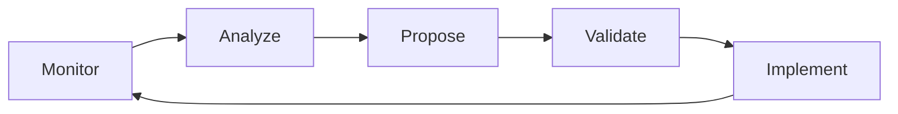

# Self-Maintenance Strategy

Strategy for ClaudeAutoPM to maintain and improve itself using its own capabilities.

## Execution Model

### Continuous Improvement Loop


## Agent Orchestration

### For Daily Maintenance
1. **registry-manager** - Validate consistency
2. **test-runner** - Execute smoke tests
3. **code-analyzer** - Check recent changes

### For Optimization
1. **optimization-analyzer** - Find opportunities
2. **code-analyzer** - Validate safety
3. **test-runner** - Verify changes
4. **registry-manager** - Update registry

### For Releases
1. **installer-tester** - Test all scenarios
2. **test-runner** - Full test suite
3. **github-operations-specialist** - Create release
4. **registry-manager** - Update documentation

## Automation Workflows

### GitHub Actions Integration
```yaml
.github/workflows/self-maintenance.yml:
  schedule:
    - cron: '0 0 * * *'  # Daily
  jobs:
    validate:
      - pm validate
    optimize:
      - pm optimize --analyze
    report:
      - pm health
```

### Local Development
```bash
# Pre-commit hook
pm validate registry
pm test quick

# Pre-push hook
pm validate all
pm optimize --analyze
```

## Decision Trees

### When to Consolidate Agents
```
IF agent_count > 40
  AND overlap > 30%
  AND risk < medium
THEN consolidate

IF performance_degradation > 10%
  AND context_usage > 70%
THEN optimize immediately
```

### When to Release
```
IF all_tests_pass
  AND no_critical_bugs
  AND documentation_complete
THEN release

IF security_issue
THEN hotfix immediately
```

## Metrics Dashboard

### Real-time Monitoring
```yaml
health_status:
  agents:
    total: 35
    active: 30
    deprecated: 5

  performance:
    context_efficiency: 60%
    test_coverage: 95%
    installation_success: 98%

  quality:
    bugs_open: 2
    tech_debt: low
    documentation: current
```

### Alerts
- Agent count > 40 → Trigger optimization
- Test coverage < 90% → Block release
- Installation failure > 2% → Investigate

## Risk Management

### Change Categories
1. **Safe** - Auto-apply
   - Documentation updates
   - Test additions
   - Bug fixes

2. **Moderate** - Review required
   - Agent consolidation
   - Performance optimization
   - Feature additions

3. **High** - Manual approval
   - Breaking changes
   - Core modifications
   - Security updates

## Integration Points

### With CI/CD
- GitHub Actions for automation
- npm scripts for local tasks
- Docker for isolated testing

### With Project Tools
- Uses own agents for maintenance
- Leverages own commands
- Follows own rules

## Success Metrics

### Short-term (Weekly)
- Zero regression failures
- 100% registry validity
- <5 minute maintenance time

### Long-term (Monthly)
- 10% context reduction
- 20% performance improvement
- 50% automation coverage

## Rollback Strategy

### Automatic Rollback If:
- Test coverage drops >5%
- Installation success <95%
- Performance degrades >10%

### Manual Rollback For:
- User-reported issues
- Security vulnerabilities
- Data corruption

## Communication

### Internal
- Git commit messages
- PR descriptions
- Code comments

### External
- Release notes
- CHANGELOG.md
- Migration guides

This strategy ensures ClaudeAutoPM continuously improves itself while maintaining stability and quality.