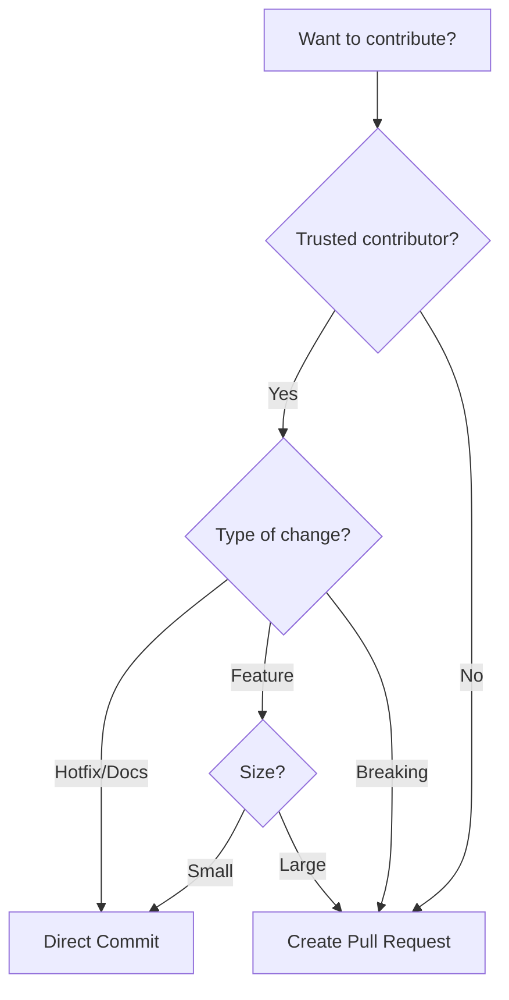

# Contributing to ClaudeAutoPM

Thank you for your interest in contributing to ClaudeAutoPM! This project uses a flexible hybrid workflow that adapts to different types of contributions.

## ⚠️ IMPORTANT: AI Attribution Policy

### AI Tools Are NOT Contributors
**CRITICAL RULE**: AI assistants (Claude, GitHub Copilot, ChatGPT, etc.) must NEVER be listed as contributors or co-authors.

❌ **FORBIDDEN in commits:**
- `Co-Authored-By: Claude <noreply@anthropic.com>`
- `Co-Authored-By: Copilot <...@users.noreply.github.com>`
- `Generated with Claude Code`
- `Generated by Copilot`
- Any AI tool attribution

✅ **ONLY allowed:**
- Human contributors with real names and emails
- Actual team members who wrote or reviewed code

### Why This Policy Exists
- **Legal**: AI cannot hold copyright or be legal contributors
- **Attribution**: Credit belongs to humans using tools, not the tools themselves
- **Professional**: AI is a development tool, like an IDE or compiler

### Automatic Enforcement
- Git hooks automatically remove AI attributions from commits
- CI/CD validates and rejects commits with AI co-authors
- Contributors list shows only human developers

## 🎯 Quick Start

### For Small Changes (Direct Commits)
If you're a trusted contributor making small fixes:
```bash
git checkout main
git pull origin main
# Make your changes
npm test
git commit -m "fix: description"
git push origin main
```

### For Features (Pull Requests)
For new features or if you're a new contributor:
```bash
git checkout -b feat/your-feature
# Make your changes
npm test
git commit -m "feat: description"
git push origin feat/your-feature
# Open PR on GitHub
```

## 📊 Contribution Decision Tree



## 🔧 Development Setup

1. **Clone the repository**
   ```bash
   git clone https://github.com/rafeekpro/ClaudeAutoPM.git
   cd ClaudeAutoPM
   ```

2. **Install dependencies**
   ```bash
   npm install
   ```

3. **Run tests**
   ```bash
   npm test
   ```

4. **Install locally for testing**
   ```bash
   npm link
   autopm --help
   ```

## 📝 Commit Guidelines

We use **Conventional Commits** for all contributions:

- `feat:` New feature
- `fix:` Bug fix
- `docs:` Documentation
- `style:` Formatting (no code change)
- `refactor:` Code restructuring
- `test:` Adding tests
- `chore:` Maintenance

### Good Commit Messages
✅ `fix: resolve installation error on Windows`
✅ `feat: add GitLab CI/CD support`
✅ `docs: clarify Azure DevOps setup`

### Bad Commit Messages
❌ `fixed stuff`
❌ `update`
❌ `wip`

## 🚦 When to Use Each Workflow

### Direct Commits ✅
**Appropriate for:**
- Critical hotfixes
- Documentation typos
- Small bug fixes
- Config updates
- Trusted contributors

**Requirements:**
- Pass all tests locally
- Follow commit conventions
- Small, focused changes

### Pull Requests 🔄
**Required for:**
- New features
- Breaking changes
- Large refactors
- External contributors
- Dependency updates
- Experimental work

**Benefits:**
- Code review
- CI/CD validation
- Discussion platform
- Change documentation

## 🧪 Testing

Before submitting any contribution:

1. **Run unit tests**
   ```bash
   npm test
   ```

2. **Run linting**
   ```bash
   npm run lint
   ```

3. **Test installation**
   ```bash
   npm run test:install
   ```

4. **For new features, add tests**
   - Create test files in `test/`
   - Follow existing patterns
   - Ensure coverage

## 🏗️ Project Structure

```
AUTOPM/
├── autopm/           # Framework resources
│   └── .claude/      # Claude configuration
├── bin/              # CLI executables
├── install/          # Installation scripts
├── test/             # Test suites
└── docs/             # Documentation
```

## 🔄 CI/CD Pipeline

Our GitHub Actions run on:
- **Direct commits to main**: Quick validation
- **Pull requests**: Comprehensive testing

### What Gets Tested
- Installation scenarios
- Security checks
- Docker integration (if applicable)
- Kubernetes deployment (if applicable)
- Cross-platform compatibility

## 💡 Development Tips

### Local Testing
```bash
# Test installation locally
./install/install.sh /tmp/test-project

# Test specific scenario
echo "1" | ./install/install.sh /tmp/test-minimal

# Test CLI commands
node bin/autopm.js --help
```

### Debug Mode
```bash
# Enable verbose output
export VERBOSE=1
npm test

# Debug installation
export AUTOPM_DEBUG=1
autopm install
```

## 🎯 Areas for Contribution

### High Priority
- [ ] Additional CI/CD platform support
- [ ] Windows compatibility improvements
- [ ] More language-specific templates
- [ ] Performance optimizations

### Good First Issues
- [ ] Documentation improvements
- [ ] Add more examples
- [ ] Improve error messages
- [ ] Add unit tests

### Feature Ideas
- [ ] Web UI for configuration
- [ ] Plugin system
- [ ] More agent types
- [ ] Integration with more tools

## 🤝 Code of Conduct

### Be Respectful
- Constructive feedback only
- Help newcomers
- Respect different opinions

### Be Professional
- Stay on topic
- No spam or self-promotion
- Follow GitHub's terms

## 📞 Getting Help

- **Questions**: Open a [Discussion](https://github.com/rafeekpro/ClaudeAutoPM/discussions)
- **Bugs**: Open an [Issue](https://github.com/rafeekpro/ClaudeAutoPM/issues)
- **Ideas**: Start a [Discussion](https://github.com/rafeekpro/ClaudeAutoPM/discussions/categories/ideas)

## 🏆 Recognition

Contributors are recognized in:
- Release notes
- Contributors file
- Project README

## 📜 License

By contributing, you agree that your contributions will be licensed under the MIT License.

## 🔐 Security

For security vulnerabilities, please email directly instead of opening a public issue.

---

Thank you for helping make ClaudeAutoPM better! 🚀