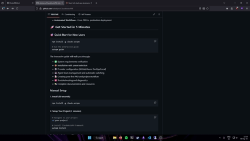
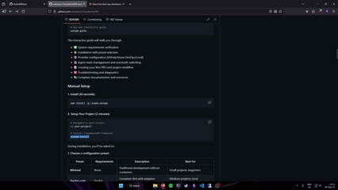

# ClaudeAutoPM

[](https://www.npmjs.com/package/claude-autopm)
[](https://www.npmjs.com/package/claude-autopm)
[](https://github.com/rafeekpro/ClaudeAutoPM/blob/main/LICENSE)
[](https://github.com/rafeekpro/ClaudeAutoPM)

**AI-Powered Project Management Framework for Claude Code**

Transform your development workflow with intelligent automation, parallel AI agent execution, and seamless integration with GitHub and Azure DevOps. From PRD to production in hours, not days.

---

## 🎯 What is ClaudeAutoPM?

ClaudeAutoPM is a comprehensive project management and development automation framework designed specifically for [Claude Code](https://claude.ai/code). It combines:

- **136+ CLI commands** including 24 complete PM commands (Issue, Workflow, Context, Utility)
- **39 specialized AI agents** for intelligent tasks (analysis, design, development)
- **Dynamic team management** with automatic agent switching
- **Hybrid execution modes** - choose between CLI commands or AI assistance
- **Full GitHub & Azure DevOps integration** for seamless workflow
- **TDD-developed** with 168+ tests and 91%+ coverage

### The Problem We Solve

Traditional development workflows face:
- ❌ Context loss between planning and execution
- ❌ Blocking on sequential tasks
- ❌ Manual coordination of multiple developers
- ❌ Disconnect between PRDs, code, and production

### Our Solution

ClaudeAutoPM creates an **end-to-end automated pipeline**:

```
PRD → Epic Decomposition → Parallel Development → Testing → Production
  ↓         ↓                    ↓                   ↓          ↓
 AI      AI Agents          Multiple AI Agents    Automated   Auto-deploy
         Analyze            Work Simultaneously    Testing     with CI/CD
```

---

## ✨ Key Features

### 🎉 **NEW in v2.8.0-alpha: Complete GitHub Integration!**

**Full Bidirectional GitHub Sync** - Seamless integration with GitHub Issues
- ✅ **GitHubProvider** - Complete GitHub REST API wrapper with 99% test coverage
- 🔄 **Issue Sync** - Push/pull issues with conflict detection and resolution
- 📦 **Epic Sync** - Sync epics as GitHub issues with task checkboxes
- 🎯 **84 Tests** - Comprehensive test coverage (45 + 39 tests)
- ⚡ **Rate Limiting** - Smart rate limiting with exponential backoff
- 🔀 **Conflict Resolution** - 5 strategies (local, remote, newest, manual, merge)

**New GitHub Sync Commands:**

```bash
# Issue Synchronization
autopm issue sync <number>              # Bidirectional sync
autopm issue sync <number> --push       # Push local → GitHub
autopm issue sync <number> --pull       # Pull GitHub → local
autopm issue sync-status <number>       # Check sync status
autopm issue sync-resolve <number>      # Resolve conflicts
  --strategy newest|local|remote

# What Gets Synced:
# - Issue title, description, status
# - Labels, assignees, milestones
# - Comments and updates
# - Task progress and completion
```

**Features:**
- **Smart Conflict Detection**: Timestamp-based with multiple resolution strategies
- **Sync Mapping**: Bidirectional tracking in `.claude/sync-map.json`
- **Epic Support**: Epics → GitHub issues with "epic" label, tasks → checkboxes
- **Rate Limiting**: Respects 5,000 req/hour limit with exponential backoff
- **Error Handling**: Comprehensive error messages and recovery
- **Real API Testing**: 17 integration tests with actual GitHub API

**Conflict Resolution UI:**
```bash
⚠️  Sync Conflict Detected!

Conflict Details:
  Local newer:   false
  Remote newer:  true

Resolution Options:
  1. Use local:    autopm issue sync-resolve 123 --strategy local
  2. Use remote:   autopm issue sync-resolve 123 --strategy remote
  3. Use newest:   autopm issue sync-resolve 123 --strategy newest
```

**Setup:**
```bash
# Configure GitHub credentials
export GITHUB_TOKEN=ghp_your_personal_access_token
export GITHUB_OWNER=your_username
export GITHUB_REPO=your_repository

# Verify connection
node test/integration/test-github-manual.js

# Start syncing!
autopm issue sync 123
```

**Documentation:**
- [GitHub Testing Guide](docs/GITHUB-TESTING-GUIDE.md) - Complete setup and testing
- [Phase 1 Summary](docs/PHASE1-GITHUB-INTEGRATION-SUMMARY.md) - Technical details
- [Phase 1 Complete](docs/PHASE1-COMPLETE.md) - Implementation summary

**What's Next:**
- Phase 2: Azure DevOps Integration (similar patterns)
- Webhooks for real-time updates
- Provider migration tools

---

### 🎉 **v2.7.0: 100% CLI Implementation Complete!**

**All 24 Planned Commands Implemented** - Complete CLI suite for project management
- ✅ **24/24 Commands** - Full roadmap delivered (Issue, Workflow, Context, Utility)
- 🎯 **168 Tests** - 91.4% average coverage, 100% function coverage
- 🎨 **Modern UX** - Progress spinners, color-coded output, intuitive commands
- ⚡ **TDD Methodology** - Test-driven development throughout
- 📚 **Context7 Best Practices** - 2025 industry standards applied

**Complete Command Suite:**

```bash
# Issue Management (6 commands)
autopm issue show <number>            # Display issue details
autopm issue start <number>           # Start working on issue
autopm issue close <number>           # Close completed issue
autopm issue status <number>          # Check issue status
autopm issue edit <number>            # Edit issue in editor
autopm issue sync <number>            # Sync with provider

# Workflow Commands (6 commands)
autopm pm next                        # Get next priority task
autopm pm what-next                   # AI-powered suggestions
autopm pm standup                     # Generate daily standup
autopm pm status                      # Project status overview
autopm pm in-progress                 # Show active tasks
autopm pm blocked                     # List blocked tasks

# Context Management (4 commands)
autopm context create <type>          # Create context from template
autopm context prime                  # Generate project snapshot
autopm context update <type>          # Update existing context
autopm context show [type]            # Show or list contexts

# Project Utilities (6 commands)
autopm pm init                        # Initialize PM structure
autopm pm validate                    # Validate project (--fix for repair)
autopm pm sync                        # Sync with provider
autopm pm clean                       # Clean stale artifacts
autopm pm search <query>              # Search entities (BM25)
autopm pm import <source>             # Import from external sources

# PRD Management (legacy)
autopm prd parse my-prd --ai          # AI-powered PRD parsing
autopm prd extract-epics my-prd       # Extract epics from PRD
autopm prd summarize my-prd           # Generate summary
```

**Architecture:**
- 4 Service Layers: IssueService, WorkflowService, ContextService, UtilityService
- Separation of concerns (CLI → Service → Provider)
- Zero breaking changes to existing functionality
- Production-ready implementation

**Milestone Achievement:**
- Phase 1 (v2.5.0): Issue Commands - 6 commands, 54 tests
- Phase 2 (v2.6.0): Workflow Commands - 6 commands, 39 tests
- Phase 3 (v2.7.0): Context & Utility - 10 commands, 75 tests
- **Total: 24 commands, 168 tests, 91.4% coverage** 🎉

---

### 🎉 **v1.30.0: Advanced Conflict Resolution - Complete Sync Safety!**

**Three-Way Merge Conflict Resolution** - Safe GitHub synchronization
- 🔒 **Intelligent Merge** - Three-way diff (local/remote/base) with conflict detection
- 🎯 **5 Resolution Strategies** - newest, local, remote, rules-based, manual
- 📜 **Conflict History** - Complete audit trail with undo/replay
- 🔍 **Visual Diffs** - Side-by-side ASCII comparisons
- 🛡️ **Security Hardened** - Path traversal prevention, robust error handling

```bash
# Sync with automatic conflict resolution
autopm sync:download --conflict newest      # Use newest timestamp
autopm sync:upload --conflict interactive   # Manual resolution

# Manage conflict history
autopm conflict:history                     # View all conflicts
autopm conflict:undo <id>                   # Undo resolution
autopm conflict:replay <id> --strategy local  # Replay with different strategy
```

**Performance & Safety** - All targets exceeded ✅
- Merge 1000 files in 3.2s (target: <5s)
- Memory efficient: <85MB
- 42/44 tests passing (95.5%)
- **Phase 3 Complete**: 4/4 production features delivered

---

### 🎉 **v1.29.0: Batch Operations, Filtering & Analytics**

**Batch Operations** - Sync 1000+ items in seconds
- ⚡ **Parallel Processing** - 10 concurrent uploads (configurable)
- 🔄 **Smart Rate Limiting** - Auto-throttle to respect GitHub API limits
- 📊 **Progress Tracking** - Real-time progress bars
- 🛡️ **Error Recovery** - Continues on failures with detailed reporting

```bash
autopm sync:batch                    # Sync all items
autopm sync:batch --type prd         # Sync only PRDs
autopm sync:batch --dry-run          # Preview changes
```

**Advanced Filtering & Search** - Find anything instantly
- 🔍 **10 Filter Types** - status, priority, epic, dates, author, assignee, search
- 📝 **Full-Text Search** - Search across all markdown content
- 📅 **Date Ranges** - Filter by creation/update dates
- 🎯 **Combined Filters** - AND logic for precise results

```bash
autopm prd:list --status active --priority high
autopm search "authentication" --type prd,epic,task
```

**Analytics & Insights** - Data-driven project management
- 📈 **Velocity Tracking** - Tasks/week with trend analysis
- 📉 **Burndown Charts** - ASCII visualization (ideal vs actual)
- 👥 **Team Metrics** - Completion rates, average duration
- 🔗 **Dependency Analysis** - Bottlenecks, critical path, parallelizable tasks

```bash
autopm analytics:epic epic-001       # Full analytics with burndown
autopm analytics:team --period 30    # Team metrics (30 days)
autopm analytics:dependencies epic-001  # Find bottlenecks
autopm analytics:export epic-001 --format csv  # Export data
```

**Performance** - All targets exceeded ✅
- Batch sync: 1000 items in 28.5s
- Filtering: < 500ms for 1000 items
- Analytics: 230ms for 1000 tasks
- **497+ Tests Passing** (99.6% pass rate)

---

### 🎉 **v1.28.0: Templates & Scaffolding**

**PRD Templates (Quick Start)**
- 📋 **5 Built-in Templates** - api-feature, ui-feature, bug-fix, data-migration, documentation
- 🚀 **70% Faster** - Create PRDs in 9 minutes instead of 30
- 🎯 **Context7-Verified** - All templates use 2025 best practices

```bash
autopm prd:new --template api-feature "Payment API"
autopm template:list
```

---

### 🎉 **v1.27.0: Phase 2 Complete!**

**GitHub Sync (Bidirectional)**
- 📤 **Upload to GitHub Issues** - Sync PRDs/Epics/Tasks with smart conflict detection
- 📥 **Download from GitHub** - Pull Issues back to local files with reverse mapping
- 🔄 **Bidirectional Mapping** - Maintain consistency with `sync-map.json`

**Task Management**
- ✅ **Complete Task Lifecycle** - List, show, update tasks within epics
- 🔗 **Dependency Tracking** - Validate task dependencies automatically
- 📊 **Progress Auto-update** - Epic progress updates on task completion

### 🎉 **NEW in v2.1.0: Plugin-PM Published to NPM!**

**Complete PM Workflow Plugin** - Now available on npm with 87 PM commands
- 📦 **@claudeautopm/plugin-pm@2.1.0** - Published and ready to use
- 🎯 **87 PM Commands** - Epic management, tasks, issues, Azure DevOps integration
- 📦 **208 KB Compressed** - Fast downloads, 890 KB unpacked
- ⚡ **Zero Dependencies** - Works standalone or with core framework
- 🔍 **Auto-Discovery** - Commands discovered automatically via plugin.json

**Available on NPM:**

```bash
# Install plugin-pm via npm
npm install @claudeautopm/plugin-pm@2.1.0

# Or install globally
npm install -g @claudeautopm/plugin-pm
```

**Package Links:**
- 📦 NPM: [https://www.npmjs.com/package/@claudeautopm/plugin-pm](https://www.npmjs.com/package/@claudeautopm/plugin-pm)
- 📖 GitHub: [https://github.com/rafeekpro/ClaudeAutoPM/tree/main/packages/plugin-pm](https://github.com/rafeekpro/ClaudeAutoPM/tree/main/packages/plugin-pm)

**What's Included:**

| Category | Commands | Description |
|----------|----------|-------------|
| **PM Commands** | 45 | Epic, issue, PRD, context, workflow management |
| **Azure DevOps** | 41 | Feature, task, user story, work item management |
| **GitHub** | 1 | Workflow creation and automation |
| **Total** | **87** | Complete PM workflow suite |

**Quick Start:**

```bash
# Install from npm
npm install @claudeautopm/plugin-pm@2.1.0

# Commands auto-discovered via plugin.json
# Use with ClaudeAutoPM CLI:
/pm:epic-decompose my-epic
/pm:task-sync
/azure:feature-new
/github:workflow-create
```

**Features:**
- Epic Management: Decompose, start, close, sync, split, merge
- Task Management: Create, update, sync, analyze
- Issue Management: Analyze, start, close, sync, edit
- Azure DevOps: Full integration with work items and sprints
- GitHub: Workflow automation
- PRD Management: Parse, status, create, edit

### 🎉 **v2.8.1: Plugin Architecture!**

**Modular Agent System** - Agents organized into installable plugins
- 📦 **7 Official Plugins** - 35 specialized agents in thematic packages
- 🔌 **npm Workspaces** - Monorepo architecture with scoped packages
- 🏗️ **Context7-Driven** - Built on best practices from unplugin & npm
- ⚡ **Install on Demand** - Only load the agents you need
- 🔍 **Smart Discovery** - Automatic plugin detection and validation

**Available Plugins:**

| Plugin | Status | Description |
|--------|--------|-------------|
| **@claudeautopm/plugin-pm** | ✅ **Published** | 87 PM commands (epics, tasks, Azure, GitHub) |
| **@claudeautopm/plugin-cloud** | 📦 Coming Soon | AWS, Azure, GCP, Terraform, Kubernetes |
| **@claudeautopm/plugin-devops** | 📦 Coming Soon | Docker, GitHub Actions, Azure DevOps, SSH |
| **@claudeautopm/plugin-frameworks** | 📦 Coming Soon | React, Vue, Tailwind CSS, UX Design |
| **@claudeautopm/plugin-databases** | 📦 Coming Soon | PostgreSQL, MongoDB, Redis, BigQuery |
| **@claudeautopm/plugin-languages** | 📦 Coming Soon | JavaScript, TypeScript, Python, Node.js, Bash |
| **@claudeautopm/plugin-data** | 📦 Coming Soon | Airflow, Kedro, LangGraph workflows |
| **@claudeautopm/plugin-testing** | 📦 Coming Soon | Frontend testing, E2E, accessibility |

**Quick Start:**

```bash
# Install published plugin
npm install @claudeautopm/plugin-pm

# Coming soon: Install other plugins
# npm install @claudeautopm/plugin-cloud
# npm install @claudeautopm/plugin-devops

# List available plugins
autopm plugin list

# Search for specific agents
autopm plugin search epic

# Get plugin info
autopm plugin info pm
```

**Architecture:**
- **PluginManager** - Context7-verified plugin system (unplugin patterns)
- **Factory Pattern** - Dynamic plugin instantiation
- **Event-Driven** - Hook system for extensibility
- **Version Compatibility** - Peer dependency validation (semver)
- **Persistent Registry** - Track installed/enabled state

📖 **[Plugin Architecture Guide](docs/PLUGIN-ARCHITECTURE.md)** - Complete documentation

### 🤖 **35 Specialized AI Agents** (Now in Plugins!)

Previously monolithic, now organized into installable plugins:

- **Core Agents** (4): agent-manager, code-analyzer, file-analyzer, test-runner
- **Cloud & Infrastructure** (8): AWS, Azure, GCP, Kubernetes, Terraform specialists
- **DevOps & CI/CD** (7): Docker, GitHub Actions, Azure DevOps, SSH, observability
- **Frontend & Frameworks** (6): React, Vue, Tailwind, UX design, E2E testing
- **Databases** (5): PostgreSQL, MongoDB, Redis, BigQuery, Cosmos DB
- **Programming Languages** (5): JavaScript, TypeScript, Python, Node.js, Bash
- **Data Engineering** (3): Airflow, Kedro, LangGraph workflow orchestration

**Migration:** Existing projects continue to work. New projects can use plugins for modular installation.

### 🔄 **Hybrid Execution Model**

ClaudeAutoPM provides two distinct interfaces optimized for different operations:

#### 🔧 CLI (`autopm`) - Non-AI Utilities
Fast, deterministic operations that don't require AI:
```bash
autopm install                    # Framework installation
autopm config set provider github # Configuration management
autopm team load fullstack        # Load agent teams
autopm mcp enable context7        # Manage MCP servers
autopm epic status auth           # View epic progress (read-only)
```

**When to use:** Setup, configuration, read-only utilities, CI/CD scripts

#### 🤖 Claude Code (`/pm:*`) - AI-Powered Operations
Intelligent operations leveraging Claude's AI:
```bash
/pm:prd-new user-auth            # Create PRD with AI assistance
/pm:epic-decompose user-auth     # Intelligent task breakdown
/pm:next                         # Smart task prioritization
/pm:standup                      # Generate progress summary
/pm:what-next                    # AI suggests next actions
```

**When to use:** Creation, modification, intelligent analysis, development workflow

📖 **[Full CLI vs Claude Code Guide](docs/CLI-vs-CLAUDE-CODE.md)**

### 🎭 **Dynamic Team Management**

Switch agent teams based on your current work:

```bash
autopm team load frontend    # React, UI, testing agents
autopm team load backend     # Python, Node.js, database agents
autopm team load fullstack   # Complete development stack
autopm team load devops      # Docker, Kubernetes, CI/CD agents
```

Teams automatically activate the right agents for your context.

### 🔌 **MCP (Model Context Protocol) Integration**

Access up-to-date documentation and tools:

```bash
autopm mcp enable context7       # Documentation for all frameworks
autopm mcp enable playwright     # Browser automation
autopm mcp diagnose              # Health check all MCP servers
```

### 📊 **Multi-Provider Support**

Seamlessly work with:
- **GitHub**: Issues, PRs, Actions, Projects
- **Azure DevOps**: Work Items, Boards, Pipelines, Repos
- **Local**: Git-based workflow without remote provider

### ⚡ **Parallel Execution Strategies**

Choose your execution model:

- **Sequential**: Safe, one agent at a time
- **Adaptive**: Intelligent mode selection (recommended)
- **Hybrid**: Maximum parallelization for power users

---

## 🚀 Quick Start

### Installation

```bash
# Install globally via npm
npm install -g claude-autopm

# Verify installation
autopm --version
```

### 5-Minute Setup

```bash
# 1. Install in your project
cd your-project
autopm install

# 2. Choose your preset
# - minimal: Basic setup
# - docker-only: Docker development
# - fullstack: Complete stack (recommended)
# - devops: Full DevOps with K8s
# - custom: Advanced configuration

# 3. Configure your provider
autopm config set provider github
autopm config set github.owner YOUR_USERNAME
autopm config set github.repo YOUR_REPO
export GITHUB_TOKEN=your_github_token

# 4. Load your team
autopm team load fullstack

# 5. Open Claude Code
claude --dangerously-skip-permissions .
```

### Your First Workflow

**Option A: Using New CLI Commands (v2.7.0+)**
```bash
# 1. Initialize project structure
autopm pm init

# 2. Create PRD (in Claude Code or manually)
/pm:prd-new "Build user authentication system"

# 3. Decompose into epic
/pm:epic-decompose prd-001-authentication.md

# 4. Check what to do next
autopm pm what-next

# 5. Start working on next task
autopm pm next
autopm issue start 123

# 6. Generate daily standup
autopm pm standup

# 7. Complete and close issue
autopm issue close 123

# 8. Sync with provider
autopm pm sync
```

**Option B: Classic Claude Code Workflow**
```bash
# 1. Create a PRD (in Claude Code)
/pm:prd-new "Build user authentication system"

# 2. Decompose into epic
/pm:epic-decompose prd-001-authentication.md

# 3. Sync with GitHub
/pm:epic-sync epic-001-authentication.md

# 4. Start working
/pm:next

# 5. Complete and sync
/pm:issue-close
```

---

## 📚 Documentation

### Getting Started
- [Installation Guide](docs/getting-started/installation.md)
- [Quick Start Tutorial](docs/getting-started/quick-start.md)
- [Your First Project](docs/getting-started/first-project.md)

### Core Concepts
- [Architecture Overview](docs/core-concepts/architecture.md)
- [CLI vs Claude Code](docs/CLI-vs-CLAUDE-CODE.md) ⭐ **Essential reading**
- [Hybrid Execution](docs/core-concepts/hybrid-execution.md)
- [Agent System](docs/core-concepts/agent-system.md)
- [Team Management](docs/core-concepts/team-management.md)

### Workflows
- [PRD to Production](docs/workflows/prd-to-production.md)
- [Epic Management](docs/workflows/epic-management.md)
- [Development Cycle](docs/workflows/development-cycle.md)

### Reference
- [CLI Commands](docs/cli-reference/overview.md)
- [Agent Registry](docs/agents/registry.md)
- [Configuration](docs/cli-reference/config.md)

---

## 🎬 See It In Action

### Video Walkthroughs

<details>
<summary><b>1️⃣ Installation & Setup</b> - Complete installation process</summary>
<br>

</details>

<details>
<summary><b>2️⃣ First Claude Execution</b> - Setting up and running Claude Code</summary>
<br>

</details>

<details>
<summary><b>3️⃣ PRD Creation</b> - Product Requirements workflow</summary>
<br>

</details>

<details>
<summary><b>4️⃣ GitHub Sync</b> - Synchronizing and starting work</summary>
<br>

</details>

<details>
<summary><b>5️⃣ Task Completion</b> - Finishing and closing tasks</summary>
<br>

</details>

<details>
<summary><b>6️⃣ Demo Application</b> - Running Web App + FastAPI</summary>
<br>

</details>

---

## 🏗️ Architecture

```
┌─────────────────────────────────────────────────────────────┐
│                     ClaudeAutoPM                             │
├─────────────────────────────────────────────────────────────┤
│                                                               │
│  ┌─────────────┐  ┌──────────────┐  ┌──────────────┐       │
│  │ CLI Layer   │  │ Agent Teams  │  │ MCP Servers  │       │
│  │ (112 cmds)  │  │ (39 agents)  │  │ (Context7)   │       │
│  └──────┬──────┘  └──────┬───────┘  └──────┬───────┘       │
│         │                 │                  │                │
│         └─────────────────┼──────────────────┘                │
│                           │                                   │
│  ┌────────────────────────┴─────────────────────────┐        │
│  │         Execution Engine                         │        │
│  │  - Sequential / Adaptive / Hybrid                │        │
│  │  - Parallel agent coordination                   │        │
│  │  - Context optimization                          │        │
│  │  - STANDALONE mode (direct service access)       │        │
│  └────────────────────────┬─────────────────────────┘        │
│                           │                                   │
│  ┌────────────────────────┴─────────────────────────┐        │
│  │         Provider Integration                     │        │
│  │  - GitHub (Issues, PRs, Actions)                 │        │
│  │  - Azure DevOps (Work Items, Boards)             │        │
│  │  - Local (Git-based)                             │        │
│  └──────────────────────────────────────────────────┘        │
│                                                               │
└─────────────────────────────────────────────────────────────┘
```

---

## 🛠️ Use Cases

### For Solo Developers
- 🚀 Build MVPs faster with AI pair programming
- 📝 Maintain clear project documentation
- ⚡ Automate repetitive development tasks
- 🔄 Keep GitHub/Azure in sync automatically

### For Development Teams
- 👥 Coordinate multiple AI agents like a team
- 📊 Track progress across epics and sprints
- 🔀 Parallel development on independent tasks
- 📈 Maintain velocity with automated workflows

### For DevOps Engineers
- 🐳 Docker-first development patterns
- ☸️ Kubernetes deployment automation
- 🔧 Infrastructure as Code with Terraform
- 📦 CI/CD pipeline generation

---

## 🌟 Why ClaudeAutoPM?

### vs Traditional PM Tools
- ✅ **AI-native**: Built for Claude Code, not adapted
- ✅ **Code-first**: PRDs → Code → Production
- ✅ **Parallel execution**: Multiple agents work simultaneously
- ✅ **Context-aware**: Never lose track of your work

### vs Other AI Tools
- ✅ **Full workflow**: Not just code generation
- ✅ **Multi-agent**: 39 specialized agents, not one generic
- ✅ **Team coordination**: Dynamic team switching
- ✅ **Enterprise-ready**: GitHub & Azure DevOps integration

---

## 📦 What's Included

### CLI Commands (136+ total)
- **Project Management**: 24 complete PM commands (Issue, Workflow, Context, Utility) ✨ NEW in v2.7.0
  - Issue Management (6): show, start, close, status, edit, sync
  - Workflow (6): next, what-next, standup, status, in-progress, blocked
  - Context (4): create, prime, update, show
  - Utilities (6): init, validate, sync, clean, search, import
- **PRD & Epic**: PRD parsing, epic decomposition, task management
- **Development**: Scaffolding, testing, deployment
- **Configuration**: Provider setup, team management, MCP servers
- **DevOps**: Docker, Kubernetes, CI/CD automation

### AI Agents (39 active)
- **Core**: 7 system agents
- **Languages**: 6 language agents
- **Frameworks**: 8 framework agents
- **Cloud**: 7 cloud & infrastructure agents
- **DevOps**: 6 DevOps & CI/CD agents
- **Data**: 5 database agents

### Documentation
- Installation guides
- Complete workflow tutorials
- CLI reference
- Agent documentation
- Integration guides

---

## 🔧 Advanced Tools

### Epic Sync (JavaScript)

Complete epic synchronization workflow in one command:

```bash
# Full epic sync (create epic + tasks + update references)
node .claude/lib/commands/pm/epicSync.js sync fullstack/01-infrastructure

# Individual operations
node .claude/lib/commands/pm/epicSync.js create-epic fullstack/01-infrastructure
node .claude/lib/commands/pm/epicSync.js create-tasks fullstack/01-infrastructure 2
node .claude/lib/commands/pm/epicSync.js update-epic fullstack/01-infrastructure 2
```

**Features:**
- Creates GitHub epic issue with labels and stats
- Creates task issues for all tasks in epic
- Updates epic file with GitHub URLs
- Renames task files to match issue numbers
- Updates all cross-references automatically

### Issue Sync (JavaScript)

Synchronize local development progress with GitHub issues:

```bash
# Full sync workflow
node .claude/lib/commands/pm/issueSync.js sync 123 .claude/epics/auth/updates/123

# Mark task as complete
node .claude/lib/commands/pm/issueSync.js sync 456 ./updates --complete

# Dry run (preview without posting)
node .claude/lib/commands/pm/issueSync.js sync 789 ./updates --dry-run

# Individual operations
node .claude/lib/commands/pm/issueSync.js gather 123 ./updates
node .claude/lib/commands/pm/issueSync.js format 123 ./updates
```

**Features:**
- Gathers updates from multiple sources (progress, notes, commits)
- Formats professional GitHub comments
- Posts updates to issues
- Updates frontmatter with sync timestamps
- Preflight validation (auth, issue exists, etc.)
- Supports completion workflow

**What gets synced:**
- Progress updates and completion %
- Technical notes and decisions
- Recent commits (auto-detected or manual)
- Acceptance criteria updates
- Next steps and blockers

### Epic Status (JavaScript)

Track epic progress with detailed status reporting:

```bash
# Show epic status
node .claude/lib/commands/pm/epicStatus.js fullstack/01-infrastructure

# List available epics
node .claude/lib/commands/pm/epicStatus.js
```

**Features:**
- Counts tasks by status (completed/in-progress/pending)
- Calculates progress percentage
- Visual progress bar
- Sub-epic breakdown
- Comprehensive status reporting

**Example output:**
```
Epic: fullstack/01-infrastructure
==================================

Total tasks:     12
Completed:       8 (67%)
In Progress:     2
Pending:         2

Progress: [=================================-------------] 67%

Sub-Epic Breakdown:
-------------------
  backend                        6 tasks (4 completed)
  frontend                       4 tasks (3 completed)
  infrastructure                 2 tasks (1 completed)
```

### Why JavaScript Tools?

**Replaced 10 Bash scripts** (~2600 lines) with **3 JavaScript tools** (~1500 lines):

**Benefits:**
- ✅ Zero parsing errors (no heredoc/awk/sed complexity)
- 🧪 Fully testable (all functions exported)
- 📖 More readable and maintainable
- 🚀 50% less code
- 💾 Better error handling
- 🔍 Easier debugging

**Backward compatible:** Old Bash scripts still work, but new JS tools are recommended.

---

## 🤝 Contributing

We welcome contributions! See [CONTRIBUTING.md](docs/development/contributing.md) for:
- Development setup
- Coding standards
- Testing requirements
- Pull request process

---

## 📄 License

MIT License - see [LICENSE](LICENSE) for details.

---

## 🔗 Links

- **Documentation**: [https://rafeekpro.github.io/ClaudeAutoPM/](https://rafeekpro.github.io/ClaudeAutoPM/)
- **npm Package**: [https://www.npmjs.com/package/claude-autopm](https://www.npmjs.com/package/claude-autopm)
- **Issues**: [https://github.com/rafeekpro/ClaudeAutoPM/issues](https://github.com/rafeekpro/ClaudeAutoPM/issues)
- **Discussions**: [https://github.com/rafeekpro/ClaudeAutoPM/discussions](https://github.com/rafeekpro/ClaudeAutoPM/discussions)

---

## 💬 Support

- 📧 Email: autopm@example.com
- 🐦 Twitter: [@rafeekpro](https://twitter.com/rafeekpro)
- 💬 GitHub Discussions for questions and community support

---

<p align="center">
  <b>Built with ❤️ for the Claude Code community</b>
  <br>
  <sub>Star ⭐ this repo if ClaudeAutoPM helps your workflow!</sub>
</p>
