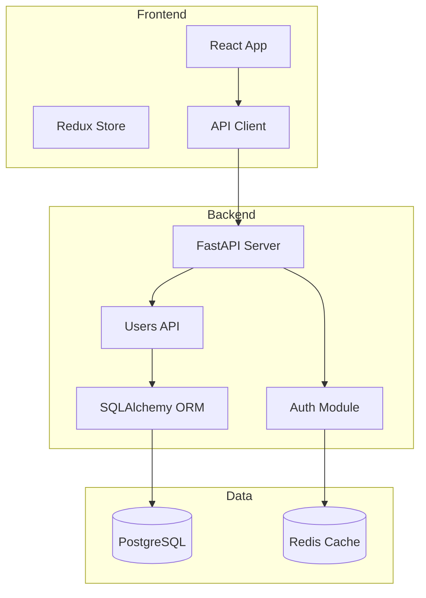

# Diagram New

Create a project architecture diagram by analyzing the codebase.

## Usage
/pm:diagram-new <name> [--type architecture|modules|data-flow|dependencies]

## Instructions

1. Determine diagram type from --type flag or infer from project:
   - **architecture**: High-level system components and how they connect
   - **modules**: Import/require dependency graph between source files
   - **data-flow**: How data moves through the system (API → service → DB)
   - **dependencies**: package.json dependency tree

2. Analyze the project:
   - Read package.json for dependencies and project type
   - Scan src/ or main source directory for imports/requires
   - Check for docker-compose.yml, Dockerfile
   - Check for API routes (Express, FastAPI, etc.)
   - Check for database models/schemas
   - Check for .env for external service connections
     **NEVER include actual .env values (tokens, passwords, secrets) in diagram or metadata.**
     Only infer service names/types from variable names, not values.

3. Generate Mermaid diagram based on analysis:
   - Use `graph TD` for hierarchical, `graph LR` for flow
   - Group related modules in `subgraph` blocks
   - Use icons: databases [(DB)], services [Service], external{{External}}
   - Color-code using Mermaid classDef:
     ```
     classDef active fill:#d4f8db,stroke:#2f855a
     classDef config fill:#e2e8f0,stroke:#4a5568
     classDef api fill:#ebf4ff,stroke:#2b6cb0
     class FastAPI api
     class PostgreSQL active
     ```

4. Save diagram:
   ```bash
   mkdir -p .claude/pm/diagrams
   ```
   Write Mermaid syntax to `.claude/pm/diagrams/<name>.mmd`
   Write metadata to `.claude/pm/diagrams/<name>.meta.json`:
   ```json
   {"name":"<name>","type":"<type>","created":"<ISO>","updated":"<ISO>","scope":"src/"}
   ```

5. Display the diagram in terminal (show the Mermaid source)

## Example Output

For a FastAPI + React project:

