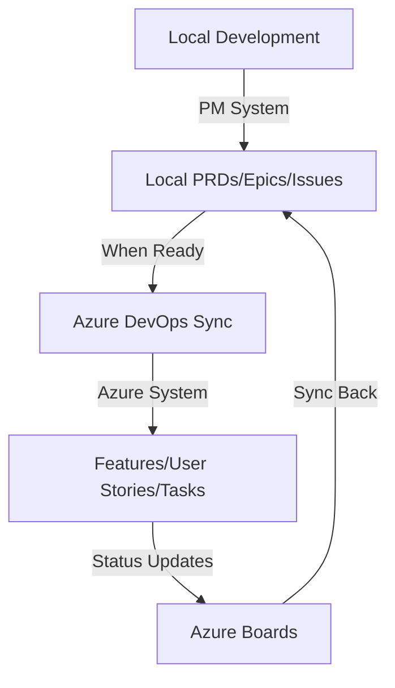

# PM and Azure DevOps Systems Coexistence Strategy

## Overview

ClaudeAutoPM provides **two complementary project management systems** that work together:

1. **PM System** (`/pm:*`) - Local, file-based, universal project management
2. **Azure DevOps System** (`/azure:*`) - Enterprise integration with Azure DevOps

**These systems are designed to coexist, not compete.** Choose based on your needs or use both together.

## When to Use Each System

### Use PM System When:
- 🏠 **Working locally** without external dependencies
- 🚀 **Starting new projects** before setting up external tools
- 📝 **Managing personal tasks** and TODOs
- 🔒 **Working offline** or in air-gapped environments
- 🎯 **Focusing on code** without process overhead
- 🌍 **Using any git platform** (GitHub, GitLab, Bitbucket, etc.)

### Use Azure DevOps System When:
- 🏢 **Working in enterprise** environments
- 👥 **Collaborating with teams** using Azure DevOps
- 📊 **Tracking metrics** (velocity, burndown, capacity)
- 🔄 **Syncing with external** work items
- 📈 **Reporting to stakeholders** through Azure boards
- ⚡ **Integrating with CI/CD** pipelines in Azure

## How They Work Together

### Complementary Workflow



### Example: Hybrid Workflow

1. **Start locally with PM:**
   ```bash
   /pm:prd-new "New Feature"          # Create local PRD
   /pm:epic-decompose                 # Break down locally
   /pm:issue-start                     # Start development
   ```

2. **Sync to Azure when ready:**
   ```bash
   /azure:import-us                    # Import to Azure DevOps
   /azure:us-parse                     # Create Azure tasks
   /azure:sprint-plan                  # Add to sprint
   ```

3. **Track in both systems:**
   ```bash
   /pm:status                          # Local status
   /azure:sprint-status                # Team dashboard
   /pm:standup                         # Personal standup
   /azure:standup                      # Team standup
   ```

## System Capabilities Comparison

| Capability | PM System | Azure DevOps | Best Choice |
|------------|-----------|--------------|-------------|
| **Offline Work** | ✅ Excellent | ❌ Requires connection | PM |
| **Team Collaboration** | 🔶 Basic (via git) | ✅ Full featured | Azure |
| **Metrics & Reports** | 🔶 Basic | ✅ Enterprise grade | Azure |
| **Speed** | ✅ Instant | 🔶 API calls | PM |
| **Setup Complexity** | ✅ None | 🔶 Configuration needed | PM |
| **External Integration** | 🔶 Limited | ✅ Full ecosystem | Azure |
| **Version Control** | ✅ Git native | ✅ Git integrated | Both |
| **Customization** | ✅ Full control | 🔶 Template based | PM |
| **Audit Trail** | 🔶 Git history | ✅ Full audit log | Azure |
| **Cost** | ✅ Free | 💰 Licensing | PM |

## Migration Paths

### PM → Azure DevOps
```bash
# Convert local PRD to User Story
/pm:prd-new "Feature X"
/azure:import-us --from-prd "Feature X"

# Sync local epic to Feature
/pm:epic-decompose "Epic Y"
/azure:feature-new --from-epic "Epic Y"
```

### Azure DevOps → PM
```bash
# Import Azure work items locally
/azure:us-list --export-to-pm
/pm:import --from-azure

# Mirror Azure sprint locally
/azure:sprint-status --sync-to-pm
```

## Configuration Options

### 1. PM-Only Mode
```json
{
  "features": {
    "pm_system": true,
    "azure_integration": false
  }
}
```

### 2. Azure-Only Mode
```json
{
  "features": {
    "pm_system": false,
    "azure_integration": true
  }
}
```

### 3. Hybrid Mode (Recommended)
```json
{
  "features": {
    "pm_system": true,
    "azure_integration": true,
    "sync_direction": "bidirectional"
  }
}
```

## Best Practices

### For Individual Developers
1. Start with PM system for personal productivity
2. Use Azure system when joining enterprise projects
3. Keep PM for personal notes, Azure for team items

### For Small Teams
1. Use PM for rapid prototyping and MVPs
2. Migrate to Azure as team grows
3. Keep PM for technical debt tracking

### For Enterprises
1. Use Azure for official work items
2. Allow PM for developer productivity
3. Sync critical items between systems

## Command Quick Reference

### Equivalent Commands

| Action | PM Command | Azure Command |
|--------|------------|---------------|
| Create requirement | `/pm:prd-new` | `/azure:us-new` |
| List requirements | `/pm:prd-list` | `/azure:us-list` |
| Start work | `/pm:issue-start` | `/azure:task-start` |
| Complete work | `/pm:issue-close` | `/azure:task-close` |
| View status | `/pm:status` | `/azure:sprint-status` |
| Daily standup | `/pm:standup` | `/azure:standup` |
| Find next task | `/pm:next` | `/azure:next-task` |
| Show blockers | `/pm:blocked` | `/azure:blocked-items` |

### Unique PM Commands
- `/pm:epic-oneshot` - Quick epic creation
- `/pm:epic-merge` - Git merge coordination
- `/pm:test-reference-update` - Test tracking

### Unique Azure Commands
- `/azure:sprint-plan` - Sprint planning
- `/azure:feature-decompose` - Feature breakdown
- `/azure:work-item-sync` - External sync

## FAQ

**Q: Should I use both systems?**
A: Yes, if you work both independently and with a team using Azure DevOps.

**Q: Can I disable one system?**
A: Yes, configure in `.claude/config.json` or during installation.

**Q: Do they sync automatically?**
A: No, sync is explicit via commands to maintain control.

**Q: Which is faster?**
A: PM system is instant (local files), Azure requires API calls.

**Q: Can I migrate between them?**
A: Yes, bi-directional migration commands are available.

## Conclusion

The PM and Azure DevOps systems are **complementary tools** in your productivity toolkit:

- **PM System** = Your personal Swiss Army knife 🔧
- **Azure System** = Your enterprise collaboration platform 🏢
- **Together** = Complete project management solution 🚀

Choose the right tool for the right job, or use both for maximum flexibility!