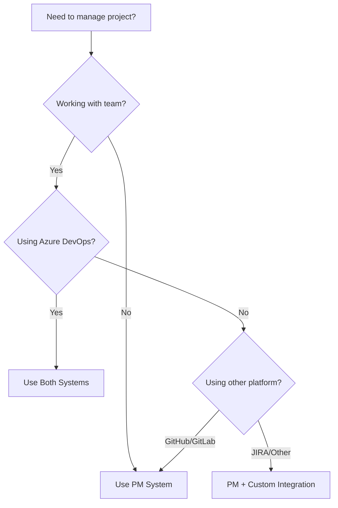

# System Selection Guide

## Quick Decision Tree



## Decision Criteria

### Choose PM System (`/pm:*`) When:

✅ **You want to:**
- Start working immediately without setup
- Work offline or in restricted environments
- Maintain personal task lists
- Prototype and experiment quickly
- Keep project management in git

❌ **You don't need:**
- Team collaboration features
- External stakeholder reporting
- Advanced metrics and analytics
- Integration with CI/CD pipelines
- Audit trails and compliance

### Choose Azure System (`/azure:*`) When:

✅ **You need:**
- Team collaboration and visibility
- Integration with Azure Pipelines
- Enterprise reporting and metrics
- Stakeholder dashboards
- Compliance and audit trails

❌ **You don't mind:**
- Initial setup and configuration
- Network dependency
- Learning Azure DevOps concepts
- Licensing costs

### Use Both Systems When:

✅ **You want:**
- Local speed with team collaboration
- Personal productivity with enterprise tracking
- Offline capability with online sync
- Git-native with external integration

## Practical Scenarios

### Scenario 1: Solo Developer on Side Project
**Recommendation**: PM System only
```bash
/pm:prd-new "My Cool App"
/pm:epic-decompose
/pm:issue-start
```

### Scenario 2: Enterprise Team Member
**Recommendation**: Both systems
```bash
# Local planning
/pm:prd-new "Feature X"
/pm:epic-decompose

# Sync to team
/azure:import-us --from-prd
/azure:sprint-plan

# Daily work
/pm:issue-start        # Local tracking
/azure:task-start      # Team visibility
```

### Scenario 3: Open Source Maintainer
**Recommendation**: PM System only
```bash
/pm:import --from-github-issues
/pm:epic-list
/pm:status
```

### Scenario 4: Consultant with Multiple Clients
**Recommendation**: PM + appropriate integration per client
```bash
# Client A (uses Azure DevOps)
/azure:us-list --project ClientA

# Client B (uses GitHub)
/pm:prd-list --tag ClientB

# Personal tracking
/pm:status --all
```

## Migration Strategies

### Starting with PM, Adding Azure Later

1. **Begin with PM for rapid development**
   ```bash
   /pm:prd-new "MVP Features"
   /pm:epic-decompose
   /pm:issue-start
   ```

2. **When team grows, add Azure**
   ```bash
   # Export existing work
   /pm:export --format azure-csv

   # Import to Azure DevOps
   /azure:import-bulk --from-csv

   # Start dual tracking
   /azure:sprint-plan
   ```

### Starting with Azure, Adding PM for Productivity

1. **Import Azure items locally**
   ```bash
   /azure:us-list --export-to-pm
   /pm:import --from-azure
   ```

2. **Use PM for personal productivity**
   ```bash
   /pm:next           # Quick task selection
   /pm:blocked        # Personal blockers
   /pm:standup        # Prep for team standup
   ```

## Configuration Examples

### PM-Only Configuration
```json
{
  "systems": {
    "pm": true,
    "azure": false
  }
}
```

### Azure-Only Configuration
```json
{
  "systems": {
    "pm": false,
    "azure": true
  },
  "azure": {
    "organization": "myorg",
    "project": "myproject",
    "pat": "${AZURE_PAT}"
  }
}
```

### Hybrid Configuration (Recommended)
```json
{
  "systems": {
    "pm": true,
    "azure": true
  },
  "sync": {
    "mode": "manual",
    "direction": "bidirectional"
  }
}
```

## Performance Comparison

| Operation | PM System | Azure System |
|-----------|-----------|--------------|
| Create item | <1ms | 500-2000ms |
| List items | <10ms | 200-1000ms |
| Update item | <1ms | 300-1500ms |
| Search | <50ms | 500-3000ms |
| Bulk operations | <100ms | 2000-10000ms |

## Cost Analysis

### PM System
- **Software**: Free (open source)
- **Infrastructure**: None (local files)
- **Training**: Minimal
- **Maintenance**: Self-managed

### Azure DevOps
- **Software**: $6-52/user/month
- **Infrastructure**: Included
- **Training**: Moderate to high
- **Maintenance**: Microsoft managed

## FAQ

**Q: Can I switch between systems later?**
A: Yes, both systems support import/export for migration.

**Q: Will using both systems create duplicate work?**
A: No, they track different aspects. PM for local work, Azure for team coordination.

**Q: Which system should I learn first?**
A: Start with PM for immediate productivity, add Azure when needed.

**Q: Can I automate sync between systems?**
A: Yes, using `/azure:sync-all` and scheduled tasks.

**Q: What if my team uses JIRA/Trello/Asana?**
A: Use PM system and create custom integration scripts.

## Conclusion

- **PM System** = Personal productivity tool
- **Azure System** = Team collaboration platform
- **Both** = Maximum flexibility

Choose based on your current needs, not future possibilities. You can always add the other system later!