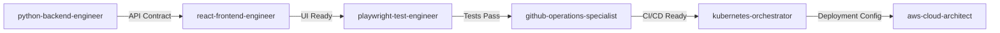
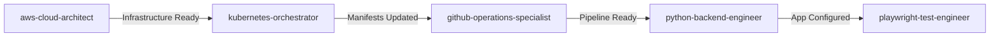
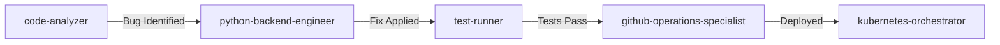

# Extended Agent Coordination Rules

Comprehensive coordination rules for the expanded agent ecosystem.

## Agent Specialization Matrix

| Agent | Primary Domain | Can Modify | Coordinates With |
|-------|---------------|------------|------------------|
| python-backend-engineer | Backend APIs | `*.py`, `requirements.txt`, `pyproject.toml` | react-frontend, kubernetes, cloud architects |
| react-frontend-engineer | Frontend UI | `*.tsx`, `*.jsx`, `*.css`, `package.json` | python-backend, playwright-test |
| github-operations-specialist | CI/CD Workflows | `.github/`, `*.yml`, `*.yaml` | All agents |
| playwright-test-engineer | E2E Tests | `tests/`, `*.spec.ts`, `playwright.config.ts` | react-frontend, python-backend |
| gcp-cloud-architect | GCP Infrastructure | `terraform/gcp/`, `*.tf` | kubernetes, python-backend |
| azure-cloud-architect | Azure Infrastructure | `terraform/azure/`, `*.tf` | kubernetes, azure-devops |
| aws-cloud-architect | AWS Infrastructure | `terraform/aws/`, `*.tf` | kubernetes, python-backend |
| kubernetes-orchestrator | K8s Manifests | `k8s/`, `charts/`, `*.yaml` | cloud architects, github-operations |
| azure-devops-specialist | Azure DevOps | `azure-pipelines.yml`, `.azuredevops/` | azure-cloud, kubernetes |
| mcp-context-manager | Context Management | `.claude/mcp-servers.json`, context pools | All agents |

## Technology Stack Coordination

### Frontend ↔ Backend

- **API Contract**: Shared through OpenAPI/Swagger specs
- **Type Generation**: Backend generates types for frontend
- **Testing**: Playwright tests both layers together
- **Error Handling**: Consistent error format across stack

### Application ↔ Infrastructure

- **Deployment**: Kubernetes manifests match app requirements
- **Secrets**: Cloud architects create, apps consume via K8s secrets
- **Networking**: Infrastructure provides endpoints, apps configure
- **Scaling**: Apps define needs, infrastructure implements

### Development ↔ Operations

- **CI/CD**: GitHub Actions validates, deploys what developers build
- **Monitoring**: Apps expose metrics, infrastructure collects
- **GitOps**: ArgoCD syncs what GitHub Actions validates
- **Rollbacks**: Coordinated through git reverts and ArgoCD

## MCP Context Pool Architecture

### Pool Definitions

```yaml
python-docs:
  agents: [python-backend-engineer, mcp-context-manager]
  sources: [context7-docs]
  filters: [fastapi, sqlalchemy, pydantic]
  
react-docs:
  agents: [react-frontend-engineer, playwright-test-engineer]
  sources: [context7-docs]
  filters: [react, nextjs, typescript]
  
cloud-docs:
  agents: [gcp-cloud-architect, azure-cloud-architect, aws-cloud-architect]
  sources: [context7-docs]
  filters: [terraform, kubernetes, docker]
  
devops-context:
  agents: [github-operations-specialist, kubernetes-orchestrator]
  sources: [context7-docs, github-mcp]
  filters: [github-actions, kubernetes, ci-cd]
  
testing-context:
  agents: [playwright-test-engineer, test-runner]
  sources: [context7-docs, playwright-mcp]
  filters: [playwright, testing, e2e]
  
project-context:
  agents: [ALL]
  sources: [context7-codebase]
  persistence: true
```

## Workflow Patterns

### Full Stack Feature Development



### Infrastructure Migration



### Hotfix Deployment



## Conflict Resolution Protocol

### Level 1: Automatic Resolution

- Git can auto-merge (different files)
- No semantic conflicts
- Tests still pass

### Level 2: Agent Coordination

- Same file, different sections
- Agent negotiates changes via update files
- Requires test validation

### Level 3: Human Intervention

- Conflicting business logic
- Architecture decisions needed
- Security implications

## Communication Channels

### 1. Git Commits

```bash
feat(api): Add user authentication endpoint

Agent: python-backend-engineer
Next: react-frontend-engineer
Context: OpenAPI spec updated at /docs/api.yaml
Tests: All passing
```

### 2. Update Files

```markdown
# Update: Issue #123 - Stream A
Agent: kubernetes-orchestrator
Status: Deployment configured
Blocked: Waiting for AWS resources
Next: aws-cloud-architect needs to provision RDS
```

### 3. MCP Context Messages

```json
{
  "agent": "playwright-test-engineer",
  "pool": "testing-context",
  "message": "Critical test failures in auth flow",
  "severity": "high",
  "affected_agents": ["python-backend-engineer", "react-frontend-engineer"]
}
```

## Priority Matrix

| Scenario | Priority | Lead Agent | Support Agents |
|----------|----------|------------|----------------|
| Production Down | P0 | kubernetes-orchestrator | cloud architects, python-backend |
| Security Vulnerability | P0 | code-analyzer | python-backend, github-operations |
| Data Loss Risk | P0 | cloud architects | kubernetes-orchestrator |
| Failed Deployment | P1 | github-operations-specialist | kubernetes-orchestrator |
| Performance Issue | P1 | python-backend-engineer | cloud architects |
| Test Failures | P2 | playwright-test-engineer | react-frontend, python-backend |
| Feature Development | P3 | Varies | Full stack |
| Technical Debt | P4 | code-analyzer | All relevant |

## Agent Capabilities

### Read-Only Agents

- code-analyzer
- file-analyzer
- test-runner (only reads, writes test results)

### Infrastructure Agents

- gcp-cloud-architect
- azure-cloud-architect  
- aws-cloud-architect
- kubernetes-orchestrator

### Application Agents

- python-backend-engineer
- react-frontend-engineer
- playwright-test-engineer

### Operations Agents

- github-operations-specialist
- azure-devops-specialist
- mcp-context-manager

## Coordination Boundaries

### Never Modify Without Coordination

- Production configurations
- Security settings
- API contracts
- Database schemas
- Authentication flows
- Payment processing
- User data handling

### Safe for Independent Work

- Documentation
- Tests (own domain)
- Logging improvements
- Code comments
- Development tools
- Local configurations

## Best Practices

1. **Context First**: Always check context pools before starting work
2. **Document Everything**: Every decision should be in commits or updates
3. **Test Continuously**: Never consider work complete without tests
4. **Escalate Uncertainty**: When in doubt, ask for human guidance
5. **Respect Boundaries**: Stay within your agent's expertise domain
6. **Coordinate Deploys**: All deployments go through github-operations-specialist
7. **Security Always**: Every agent must consider security implications
8. **Performance Matters**: Consider performance impact of all changes

## Emergency Protocols

### System Down

1. kubernetes-orchestrator takes lead
2. Cloud architect checks infrastructure
3. python-backend checks application
4. github-operations prepares rollback

### Security Breach

1. code-analyzer identifies scope
2. Cloud architects lock down resources
3. python-backend patches vulnerability
4. github-operations deploys fix

### Data Corruption

1. Cloud architects initiate backup restore
2. kubernetes-orchestrator stops affected services
3. python-backend validates data integrity
4. playwright-test verifies functionality
