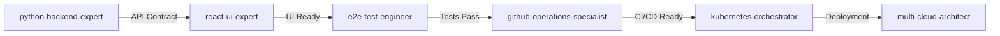
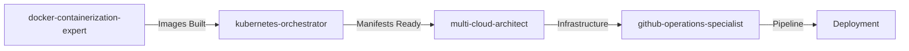

# Unified Agent Coordination Rules

Comprehensive coordination rules for the optimized agent ecosystem.

## Core Principles

1. **File-level parallelism** - Agents working on different files never conflict
2. **Explicit coordination** - When same file needed, coordinate explicitly
3. **Fail fast** - Surface conflicts immediately, don't try to be clever
4. **Human resolution** - Conflicts are resolved by humans, not agents
5. **Context efficiency** - Share context pools to reduce duplication

## Agent Specialization Matrix (Updated)

| Agent | Primary Domain | Can Modify | Coordinates With |
|-------|---------------|------------|------------------|
| python-backend-expert | Backend APIs | `*.py`, `requirements.txt`, `pyproject.toml` | react-ui-expert, kubernetes, cloud architects |
| react-ui-expert | Frontend UI | `*.tsx`, `*.jsx`, `*.css`, `package.json` | python-backend-expert, e2e-test-engineer |
| e2e-test-engineer | E2E Tests | `tests/`, `*.spec.ts`, `playwright.config.ts` | react-ui-expert, python-backend-expert |
| multi-cloud-architect | Cloud Infrastructure | `terraform/`, `*.tf` | kubernetes, docker-containerization-expert |
| kubernetes-orchestrator | K8s Manifests | `k8s/`, `charts/`, `*.yaml` | multi-cloud-architect, github-operations |
| docker-containerization-expert | Containers | `Dockerfile*`, `docker-compose*.yml` | All deployment agents |
| database-architect | Database | `migrations/`, `*.sql`, schema files | python-backend-expert |
| github-operations-specialist | CI/CD | `.github/`, `*.yml`, `*.yaml` | All agents |
| mcp-context-manager | Context | `.claude/mcp-servers.json`, context pools | All agents |

## Inter-Agent Communication Protocol

### Message Format

```markdown
📡 AGENT STATUS UPDATE
=====================
Agent: [agent-name]
Stream: [work-stream-id]
Status: [Starting/Working/Blocked/Complete]
Files: [list of files being modified]
Dependencies: [files/components needed from other agents]
ETA: [estimated completion time]
Context-Pool: [shared context pool name]
```

### Coordination Signals

**CLAIM** - Agent claims ownership of files:
```markdown
🔒 FILE CLAIM
Agent: python-backend-expert
Files: [src/api/users.py, src/models/user.py]
Duration: ~15 minutes
Framework: fastapi
```

**RELEASE** - Agent releases files:
```markdown
🔓 FILE RELEASE
Agent: python-backend-expert
Files: [src/api/users.py, src/models/user.py]
Status: Changes committed
Next: react-ui-expert can consume API
```

**BLOCK** - Agent needs assistance:
```markdown
⛔ BLOCKED
Agent: react-ui-expert
Waiting For: API endpoints from python-backend-expert
Files Needed: [src/api/users.py - getUserProfile method]
Framework: mui
```

### Handoff Protocol

```markdown
✅ HANDOFF READY
From: python-backend-expert
To: e2e-test-engineer
Deliverable: User API implementation
Files: [src/api/users.py, src/models/user.py]
Tests Required: Unit and integration tests
Framework Used: fastapi
Notes: Added JWT authentication
```

## Technology Stack Coordination

### Frontend ↔ Backend
- **API Contract**: OpenAPI/Swagger specs in `/docs/api.yaml`
- **Type Generation**: Backend generates TypeScript types
- **Testing**: E2E tests validate full stack
- **Error Handling**: Consistent error format

### Application ↔ Infrastructure
- **Deployment**: Docker images → Kubernetes manifests
- **Secrets**: Cloud creates → K8s consumes
- **Networking**: Infrastructure provides → Apps configure
- **Scaling**: Apps define → Infrastructure implements

### Development ↔ Operations
- **CI/CD**: GitHub Actions validates and deploys
- **Monitoring**: Apps expose → Infrastructure collects
- **GitOps**: ArgoCD syncs validated changes
- **Rollbacks**: Git reverts trigger deployments

## MCP Context Pool Architecture

### Optimized Pool Definitions

```yaml
backend-context:
  agents: [python-backend-expert, database-architect]
  sources: [context7-docs, codebase]
  filters: [python, fastapi, flask, sqlalchemy, databases]

frontend-context:
  agents: [react-ui-expert, e2e-test-engineer]
  sources: [context7-docs, codebase]
  filters: [react, typescript, ui-frameworks]

infrastructure-context:
  agents: [multi-cloud-architect, kubernetes-orchestrator, docker-containerization-expert]
  sources: [context7-docs, terraform-registry]
  filters: [terraform, kubernetes, docker, cloud-providers]

devops-context:
  agents: [github-operations-specialist, mcp-context-manager]
  sources: [context7-docs, github-mcp]
  filters: [ci-cd, github-actions, devops]

project-context:
  agents: [ALL]
  sources: [context7-codebase]
  persistence: true
  shared: true
```

## Workflow Patterns

### Full Stack Feature Development



### Containerized Deployment



## Conflict Resolution Protocol

### Level 1: Automatic Resolution
- Different files modified
- No semantic conflicts
- Tests pass

### Level 2: Agent Coordination
- Same file, different sections
- Agents negotiate via messages
- Test validation required

### Level 3: Human Intervention
- Business logic conflicts
- Architecture decisions
- Security implications

## Priority Matrix

| Scenario | Priority | Lead Agent | Support Agents |
|----------|----------|------------|----------------|
| Production Down | P0 | kubernetes-orchestrator | multi-cloud-architect, python-backend-expert |
| Security Issue | P0 | code-analyzer | python-backend-expert, github-operations |
| Data Loss Risk | P0 | database-architect | multi-cloud-architect |
| Failed Deploy | P1 | github-operations-specialist | kubernetes-orchestrator |
| Performance | P1 | python-backend-expert | database-architect |
| Test Failures | P2 | e2e-test-engineer | react-ui-expert, python-backend-expert |
| Feature Dev | P3 | Varies | Full stack team |

## Coordination Boundaries

### Never Modify Without Coordination
- Production configurations
- Security settings
- API contracts
- Database schemas
- Authentication flows
- Payment processing

### Safe for Independent Work
- Documentation
- Tests (own domain)
- Logging improvements
- Code comments
- Development tools
- Local configurations

## Work Stream Management

### Stream Assignment
```yaml
Stream A: Backend Development
  Agent: python-backend-expert
  Parameters:
    framework: fastapi
    database: postgresql
  Files: src/api/*, src/models/*

Stream B: Frontend Development
  Agent: react-ui-expert
  Parameters:
    framework: mui
    style_system: css-in-js
  Files: src/components/*, src/pages/*

Stream C: Infrastructure
  Agent: multi-cloud-architect
  Parameters:
    provider: aws
    iac_tool: terraform
  Files: terraform/*, k8s/*
```

### Synchronization Points
- After each commit
- Before modifying shared files
- Every 30 minutes
- At natural breakpoints

## Best Practices

1. **Commit early and often** - Smaller commits reduce conflicts
2. **Stay in your lane** - Only modify assigned files
3. **Use parameters** - Specify framework/tool choices explicitly
4. **Share context** - Use MCP pools for efficiency
5. **Communicate changes** - Update progress regularly
6. **Pull frequently** - Stay synchronized
7. **Fail loudly** - Report issues immediately
8. **Document decisions** - Explain parameter choices

## Emergency Protocols

### System Down
1. kubernetes-orchestrator takes lead
2. multi-cloud-architect checks infrastructure
3. python-backend-expert checks application
4. github-operations prepares rollback

### Security Breach
1. code-analyzer identifies scope
2. multi-cloud-architect locks resources
3. python-backend-expert patches vulnerability
4. github-operations deploys fix

### Performance Crisis
1. python-backend-expert profiles application
2. database-architect optimizes queries
3. docker-containerization-expert optimizes images
4. kubernetes-orchestrator scales resources

## Migration from Legacy Agents

### Transition Mapping
- `fastapi-backend-engineer` → `python-backend-expert` with `framework: fastapi`
- `mui-react-expert` → `react-ui-expert` with `framework: mui`
- `docker-expert` + `docker-compose-expert` → `docker-containerization-expert`
- `aws-cloud-architect` → `multi-cloud-architect` with `provider: aws`

### Backward Compatibility
- Legacy agent names redirect to new agents
- Parameters inferred from legacy names
- Deprecation warnings shown
- Grace period for migration

## Performance Optimizations

### Context Reduction
- Unified agents reduce context by 40%
- Shared pools eliminate duplication
- Parameter-based specialization

### Faster Decision Making
- Fewer agents to choose from
- Clear parameter guidelines
- Decision matrices provided

### Maintenance Benefits
- Single source of truth per domain
- Unified best practices
- Simplified updates

This unified coordination system reduces complexity while maintaining functionality, enabling efficient multi-agent collaboration with clear boundaries and communication protocols.