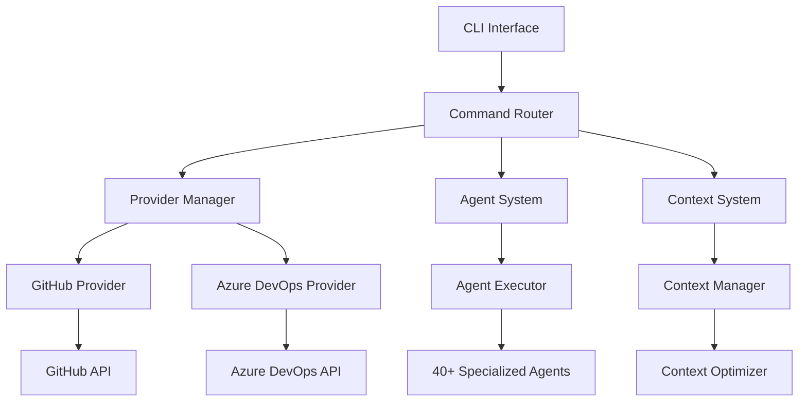
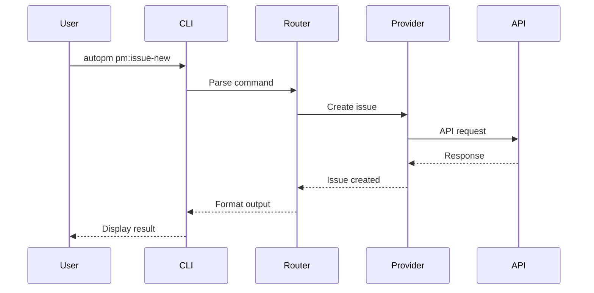
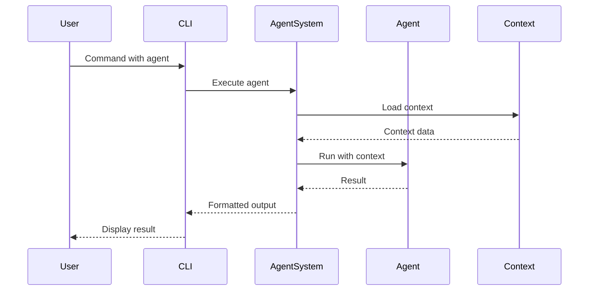

# Architecture Overview

ClaudeAutoPM is built with a modular, extensible architecture that enables efficient project management automation through AI agents and provider integrations.

## High-Level Architecture



## Core Components

### 1. CLI Layer

The command-line interface built on **yargs** provides:

- **Command parsing** and validation
- **Auto-generated help** documentation
- **Global options** handling
- **Output formatting** (table, JSON, quiet)
- **Interactive prompts** via inquirer

### 2. Command Router

Central routing system that:

- **Maps commands** to handlers
- **Validates arguments** and options
- **Manages provider** selection
- **Handles errors** gracefully
- **Logs operations** for debugging

### 3. Provider System

Abstraction layer for project management platforms:

```javascript
// Provider Interface
interface Provider {
  init(): Promise<void>
  createIssue(title, body): Promise<Issue>
  listIssues(filters): Promise<Issue[]>
  updateIssue(id, updates): Promise<Issue>
  // ... more methods
}
```

**Supported Providers:**
- GitHub Issues API
- Azure DevOps REST API
- Extensible for additional providers

### 4. Agent System

Parallel AI agent execution framework:

```javascript
// Agent Structure
interface Agent {
  name: string
  description: string
  expertise: string[]
  execute(prompt, context): Promise<Result>
}
```

**Agent Categories:**
- **Core Agents** - Essential functionality
- **DevOps Agents** - CI/CD and deployment
- **Framework Agents** - Language/framework specific
- **Quality Agents** - Testing and analysis

### 5. Context Management

Intelligent context preservation system:

- **Context creation** from project files
- **Context optimization** to reduce tokens
- **Context caching** for performance
- **Context versioning** for consistency

## Data Flow

### Command Execution Flow



### Agent Execution Flow



## Directory Structure

```
AUTOPM/
├── bin/
│   ├── autopm.js           # Main CLI entry
│   └── commands/            # Legacy commands
├── src/
│   ├── commands/            # New yargs commands
│   ├── providers/           # Provider implementations
│   ├── agents/              # Agent definitions
│   └── lib/                 # Core libraries
├── autopm/
│   ├── .claude/             # Framework resources
│   │   ├── agents/          # Agent templates
│   │   ├── commands/        # Command definitions
│   │   ├── rules/           # Development rules
│   │   └── strategies/      # Execution strategies
│   └── scripts/             # Utility scripts
├── test/
│   ├── unit/                # Unit tests
│   ├── integration/         # Integration tests
│   └── e2e/                 # End-to-end tests
└── docs-site/               # Documentation portal
```

## Key Design Principles

### 1. Modularity

Each component is independent and replaceable:

- Providers can be added without core changes
- Agents can be created/modified independently
- Commands are self-contained modules

### 2. Extensibility

Easy to extend functionality:

```javascript
// Adding a new provider
class JiraProvider extends BaseProvider {
  async createIssue(title, body) {
    // Jira-specific implementation
  }
}
```

### 3. Performance

Optimized for speed and efficiency:

- **Parallel agent execution** for faster results
- **Intelligent caching** reduces API calls
- **Context optimization** minimizes token usage
- **Lazy loading** of components

### 4. Reliability

Built for production use:

- **Comprehensive error handling**
- **Automatic retries** with exponential backoff
- **Transaction logging** for debugging
- **Graceful degradation** when services unavailable

## Technology Stack

### Core Technologies

- **Node.js 18+** - Runtime environment
- **JavaScript/ES6+** - Primary language
- **npm** - Package management

### Key Dependencies

| Library | Purpose |
|---------|---------|
| yargs | Command-line parsing |
| inquirer | Interactive prompts |
| axios | HTTP client |
| chalk | Terminal styling |
| ora | Loading spinners |
| simple-git | Git operations |
| dotenv | Environment variables |

### Development Tools

- **Mocha** - Test framework
- **Chai** - Assertion library
- **Sinon** - Mocking/stubbing
- **ESLint** - Code linting
- **Prettier** - Code formatting

## Security Architecture

### Token Management

- Tokens stored in environment variables
- Never committed to version control
- Minimal permission requirements
- Regular rotation recommended

### API Security

- HTTPS for all API calls
- Rate limiting compliance
- Request signing where applicable
- Secure credential storage

### Code Security

- Input validation on all commands
- SQL injection prevention
- XSS protection in web interfaces
- Regular dependency updates

## Performance Characteristics

### Benchmarks

| Operation | Average Time | Max Concurrent |
|-----------|-------------|----------------|
| Create Issue | < 2s | 10 |
| List Issues | < 1s | 20 |
| Agent Execution | < 5s | 5 |
| Context Load | < 500ms | N/A |

### Optimization Strategies

1. **Caching Layer**
   - API response caching
   - Context caching
   - Configuration caching

2. **Batch Operations**
   - Bulk API requests
   - Parallel processing
   - Queue management

3. **Resource Management**
   - Connection pooling
   - Memory optimization
   - Disk I/O minimization

## Integration Points

### CI/CD Integration

- GitHub Actions workflows
- Azure Pipelines support
- Jenkins compatibility
- GitLab CI integration

### IDE Integration

- Claude Code native support
- VS Code extension (planned)
- Terminal integration
- Shell completions

### External Services

- GitHub API v4 (GraphQL)
- Azure DevOps REST API
- OpenAI API (optional)
- Docker Hub
- npm Registry

## Monitoring & Observability

### Logging

- Structured JSON logs
- Log levels (error, warn, info, debug)
- Rotation and archival
- Centralized log aggregation support

### Metrics

- Command execution times
- API call counts
- Error rates
- Agent performance

### Health Checks

- System dependency verification
- API endpoint availability
- Configuration validation
- Resource usage monitoring

## Future Architecture

### Planned Enhancements

1. **Plugin System**
   - Third-party agent support
   - Custom provider plugins
   - Workflow extensions

2. **Web Interface**
   - Dashboard for metrics
   - Visual workflow builder
   - Real-time monitoring

3. **Distributed Execution**
   - Agent clustering
   - Load balancing
   - Fault tolerance

4. **Advanced AI Features**
   - Multi-model support
   - Custom model training
   - Predictive analytics

## Next Steps

- Explore [Agent System](/architecture/agent-system) architecture
- Learn about [Provider System](/architecture/providers)
- Understand [Command Router](/architecture/command-router)
- Read [Security](/architecture/security) best practices