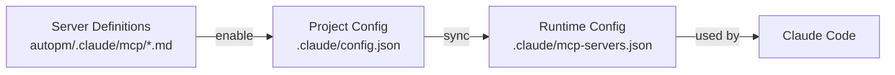

# MCP Management System Guide

## Overview

The MCP (Model Context Protocol) Management System in ClaudeAutoPM provides a comprehensive solution for managing MCP servers. It treats MCP servers similarly to agents, with centralized definitions, lifecycle management, and seamless integration.

## Architecture

```
autopm/.claude/mcp/              # MCP server definitions (framework)
├── MCP-REGISTRY.md              # Registry of all available servers
├── context7-docs.md             # Documentation server
├── context7-codebase.md         # Codebase analysis server
├── playwright-mcp.md            # Browser automation server
├── github-mcp.md                # GitHub integration server
└── [other-servers].md           # Additional server definitions

.claude/                         # Project configuration (user)
├── config.json                  # Active servers configuration
└── mcp-servers.json            # Generated runtime configuration
```

## Key Components

### 1. Server Definitions

Each MCP server is defined in a Markdown file with YAML frontmatter:

```markdown
---
name: server-name
command: npx
args: ["@package/server"]
env:
  ENV_VAR: "${ENV_VAR:-default}"
envFile: .claude/.env
description: Brief description
category: documentation|codebase|testing|integration|database
status: active|deprecated
version: ">=1.0.0"
---

# Server documentation...
```

### 2. MCP Manager Agent

The `@mcp-manager` agent (`autopm/.claude/agents/core/mcp-manager.md`) is the authoritative expert for:
- Creating server definitions
- Validating configurations
- Managing server lifecycle
- Integrating with context pools
- Troubleshooting issues

### 3. CLI Commands

The `autopm mcp` command provides comprehensive management:

```bash
autopm mcp list              # List all available servers
autopm mcp add               # Add new server interactively
autopm mcp remove <name>     # Remove a server
autopm mcp enable <name>     # Enable server in project
autopm mcp disable <name>    # Disable server in project
autopm mcp sync              # Sync configuration
autopm mcp validate          # Validate all servers
autopm mcp info <name>       # Show server details
```

### 4. Configuration Flow



## Usage Guide

### Installing MCP Support

When installing ClaudeAutoPM, MCP server definitions are automatically copied:

```bash
autopm install
# or
autopm install ~/my-project
```

### Listing Available Servers

```bash
$ autopm mcp list

📡 Available MCP Servers:

✅ Active context7-docs
    Category: documentation
    Description: Context7 documentation server for accessing technical documentation
    Location: /path/to/autopm/.claude/mcp/context7-docs.md

⚪ Inactive github-mcp
    Category: integration
    Description: GitHub MCP server for repository management
    Location: /path/to/autopm/.claude/mcp/github-mcp.md

Total: 6 servers (1 active)
```

### Enabling a Server

```bash
# Enable a server
$ autopm mcp enable context7-docs
✅ Server 'context7-docs' enabled
💡 Run 'autopm mcp sync' to update configuration

# Configure environment variables if needed
$ echo "CONTEXT7_API_KEY=your-key" >> .claude/.env

# Sync configuration
$ autopm mcp sync
🔄 Syncing MCP server configuration...
  ✅ Synced: context7-docs
✅ Configuration synced to .claude/mcp-servers.json
```

### Creating a New Server

```bash
$ autopm mcp add

🆕 Create New MCP Server

Server name (e.g., my-server): custom-api
Command (e.g., npx): npx
Arguments (comma-separated): @myorg/custom-server
Description: Custom API integration server
Category (documentation/codebase/testing/integration/database): integration

Environment variables (leave empty to skip):
Variable name (or press Enter to finish): API_KEY
Default value for API_KEY:
Variable name (or press Enter to finish): API_URL
Default value for API_URL: https://api.example.com
Variable name (or press Enter to finish):

✅ Server definition created: autopm/.claude/mcp/custom-api.md
```

### Validating Servers

```bash
$ autopm mcp validate

🔍 Validating MCP servers...

Checking context7-docs...
Checking github-mcp...
Checking playwright-mcp...

📊 Validation Results:
  Total servers: 6
  Errors: 0
  Warnings: 2

✅ All servers validated successfully
```

### Configuration Management

#### Project Configuration (`.claude/config.json`)

```json
{
  "mcp": {
    "activeServers": [
      "context7-docs",
      "github-mcp"
    ],
    "contextPools": {
      "python-docs": {
        "type": "shared",
        "agents": ["python-backend-engineer"],
        "sources": ["context7-docs"],
        "filters": ["fastapi", "sqlalchemy"]
      }
    }
  }
}
```

#### Generated Runtime Config (`.claude/mcp-servers.json`)

This file is automatically generated by `autopm mcp sync`:

```json
{
  "mcpServers": {
    "context7-docs": {
      "command": "npx",
      "args": ["@context7/mcp-server"],
      "env": {
        "CONTEXT7_MODE": "documentation"
      },
      "envFile": ".claude/.env"
    }
  }
}
```

## Advanced Features

### Context Pools

Context pools allow sharing information between agents and MCP servers:

```json
{
  "python-docs": {
    "type": "shared",
    "agents": ["python-backend-engineer", "code-analyzer"],
    "sources": ["context7-docs"],
    "filters": ["fastapi", "sqlalchemy", "pydantic"],
    "maxSize": "100MB",
    "retention": "7d",
    "refresh": "daily"
  }
}
```

### Environment Variables

Use the `${VAR:-default}` syntax for environment variables:

```yaml
env:
  API_KEY: "${API_KEY:-}"              # Required, no default
  API_URL: "${API_URL:-api.example.com}" # Optional with default
  DEBUG: "${DEBUG:-false}"             # Optional with default
```

Store sensitive values in `.claude/.env`:

```bash
CONTEXT7_API_KEY=sk-1234567890
GITHUB_TOKEN=ghp_abcdefghijk
```

### Server Categories

- **documentation**: Technical documentation access
- **codebase**: Code analysis and navigation
- **testing**: Test automation and validation
- **integration**: External service integration
- **database**: Database connections
- **monitoring**: Observability and metrics

## Integration with Agents

### Agent-MCP Mapping

| Agent | Commonly Used MCP Servers |
|-------|---------------------------|
| python-backend-engineer | context7-docs (Python docs) |
| react-frontend-engineer | context7-docs (React/JS docs) |
| code-analyzer | context7-codebase |
| test-runner | playwright-mcp |
| github-operations-specialist | github-mcp |

### Using MCP Manager Agent

```markdown
@mcp-manager create a new server for PostgreSQL database access

@mcp-manager validate all server configurations

@mcp-manager troubleshoot connection issues with context7-docs

@mcp-manager optimize context pool configuration for Python development
```

## Best Practices

### 1. Security

- Never hardcode credentials in server definitions
- Use environment variables with `${VAR:-}` syntax
- Store secrets in `.claude/.env`
- Add `.env` to `.gitignore`
- Regularly rotate API keys

### 2. Performance

- Enable only necessary servers
- Configure appropriate cache settings
- Use context pools for shared resources
- Monitor resource usage
- Implement connection pooling

### 3. Organization

- Use descriptive server names
- Assign appropriate categories
- Document usage examples
- Maintain version requirements
- Keep registry updated

### 4. Maintenance

- Run `autopm mcp validate` regularly
- Keep server definitions updated
- Remove deprecated servers
- Document breaking changes
- Test after updates

## Troubleshooting

### Common Issues

#### 1. Server Not Found

```bash
❌ Server 'my-server' not found
```

**Solution**: Check if server definition exists in `autopm/.claude/mcp/`

#### 2. Configuration Not Applied

```bash
ℹ️ Server 'context7-docs' is already enabled
```

**Solution**: Run `autopm mcp sync` after enabling/disabling servers

#### 3. Authentication Failed

Check environment variables:
```bash
cat .claude/.env | grep API_KEY
```

#### 4. Connection Issues

Enable debug mode:
```bash
export MCP_DEBUG=true
export NODE_DEBUG=mcp
```

### Debug Commands

```bash
# Show server details
autopm mcp info context7-docs

# Validate specific server
node scripts/mcp-handler.js validate

# Check active servers
cat .claude/config.json | jq .mcp.activeServers

# View generated configuration
cat .claude/mcp-servers.json | jq .mcpServers
```

## Migration from Legacy Format

If you have existing MCP servers in the old JSON format, migrate them:

1. **Export existing configuration**:
   ```bash
   cp .claude/mcp-servers.json .claude/mcp-servers.json.backup
   ```

2. **Create server definitions**:
   ```bash
   autopm mcp add
   # Follow prompts for each server
   ```

3. **Enable migrated servers**:
   ```bash
   autopm mcp enable context7-docs
   autopm mcp enable github-mcp
   ```

4. **Sync configuration**:
   ```bash
   autopm mcp sync
   ```

5. **Verify migration**:
   ```bash
   diff .claude/mcp-servers.json.backup .claude/mcp-servers.json
   ```

## API Reference

### Server Definition Schema

```typescript
interface MCPServerDefinition {
  name: string;                    // Unique server identifier
  command: string;                 // Executable command
  args: string[];                  // Command arguments
  env?: Record<string, string>;    // Environment variables
  envFile?: string;                // Path to .env file
  description: string;             // Brief description
  category: ServerCategory;        // Server category
  status: 'active' | 'deprecated'; // Server status
  version?: string;                // Version requirement
}

type ServerCategory =
  | 'documentation'
  | 'codebase'
  | 'testing'
  | 'integration'
  | 'database'
  | 'monitoring';
```

### Configuration Schema

```typescript
interface ProjectMCPConfig {
  mcp: {
    activeServers: string[];       // List of enabled servers
    contextPools?: ContextPools;   // Context pool definitions
    documentationSources?: Sources; // Documentation sources
  };
}
```

## Roadmap

### Planned Features

1. **Server Templates**: Pre-configured templates for common servers
2. **Auto-Discovery**: Automatic detection of available servers
3. **Health Monitoring**: Real-time server health checks
4. **Usage Analytics**: Track server usage and performance
5. **Plugin System**: Extensible server plugin architecture
6. **GUI Management**: Web-based server management interface

### Future Integrations

- Azure DevOps MCP
- GitLab MCP
- PostgreSQL MCP
- MongoDB MCP
- Elasticsearch MCP
- Prometheus MCP

## Contributing

To contribute new MCP servers:

1. Create server definition in `autopm/.claude/mcp/`
2. Update `MCP-REGISTRY.md`
3. Add integration tests
4. Document usage examples
5. Submit pull request

## Support

- **Documentation**: This guide
- **Agent Help**: `@mcp-manager` for expert assistance
- **Issues**: [GitHub Issues](https://github.com/rafeekpro/ClaudeAutoPM/issues)
- **Community**: [Discussions](https://github.com/rafeekpro/ClaudeAutoPM/discussions)

## Conclusion

The MCP Management System provides a robust, scalable solution for managing Model Context Protocol servers in ClaudeAutoPM projects. By treating servers as first-class citizens with proper lifecycle management, it ensures reliable and efficient integration with external services and tools.