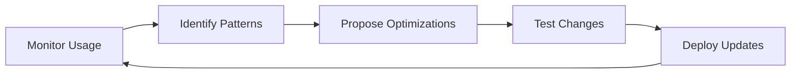

# ClaudeAutoPM Self-Maintenance Toolkit

## Overview

This document outlines the agents and tools from ClaudeAutoPM itself that should be used for maintaining and developing the ClaudeAutoPM project. This creates a self-improving ecosystem where the project uses its own capabilities.

## 🤖 Essential Meta-Agents

### 1. agent-manager
**Purpose**: Creating, analyzing, and managing other agents
**Use Cases**:
- Adding new agents to the ecosystem
- Updating agent capabilities
- Managing agent registry
- Deprecating obsolete agents
- Creating agent documentation

**Example Usage**:
```markdown
Use agent-manager to create a new specialized agent for GraphQL API development
with proper documentation, registry entry, and integration tests.
```

### 2. code-analyzer
**Purpose**: Analyzing code changes for bugs and logic flow
**Use Cases**:
- Review recent changes for potential issues
- Trace dependencies between components
- Identify code smells and anti-patterns
- Validate refactoring safety
- Security vulnerability scanning

**Example Usage**:
```markdown
Use code-analyzer to review the Phase 2 optimization changes
and identify any potential breaking changes or regressions.
```

### 3. test-runner
**Purpose**: Running and analyzing test results
**Use Cases**:
- Validate changes before commits
- Analyze test failures
- Generate test reports
- Monitor test coverage
- Performance regression testing

**Example Usage**:
```markdown
Use test-runner to execute all installation tests and analyze
any failures after the agent consolidation changes.
```

### 4. file-analyzer
**Purpose**: Analyzing and summarizing large files
**Use Cases**:
- Summarize log files
- Extract key information from documentation
- Reduce context usage when reviewing large files
- Analyze installation logs
- Review test output files

## 🛠️ Development Workflow Agents

### 5. github-operations-specialist
**Purpose**: Managing GitHub workflows and CI/CD
**Use Cases**:
- Creating and updating GitHub Actions
- Managing releases and tags
- Configuring branch protection
- Setting up automated workflows
- Managing issues and PRs

**Implementation Needed**:
```yaml
.github/workflows/self-maintenance.yml:
  - Agent validation tests
  - Documentation generation
  - Registry consistency checks
  - Installation testing
```

### 6. docker-containerization-expert
**Purpose**: Managing development containers
**Use Cases**:
- Creating development environments
- Testing in isolated containers
- Multi-environment validation
- Container-based CI/CD
- Cross-platform testing

## 📚 Documentation Agents

### 7. ux-design-expert
**Purpose**: Improving user experience and documentation
**Use Cases**:
- Enhancing README and PLAYBOOK
- Creating user journey maps
- Improving installation experience
- Designing better error messages
- Accessibility improvements

## 🔧 Configuration Management

### 8. mcp-context-manager
**Purpose**: Managing context and agent coordination
**Use Cases**:
- Optimizing context usage
- Configuring agent pools
- Managing shared resources
- Coordinating multi-agent workflows
- Performance optimization

## 📋 Project-Specific Configurations

### Required `.claude/` Structure

```yaml
AUTOPM/.claude/
├── agents/
│   ├── project-maintenance/
│   │   ├── registry-manager.md      # Manages AGENT-REGISTRY.md
│   │   ├── installer-tester.md      # Tests installation scenarios
│   │   ├── documentation-updater.md # Keeps docs in sync
│   │   └── version-manager.md       # Handles versioning
│   └── self-improvement/
│       ├── optimization-analyzer.md  # Identifies optimization opportunities
│       ├── deprecation-manager.md    # Manages deprecated features
│       └── migration-assistant.md    # Helps with version migrations
├── commands/
│   ├── pm-validate                  # Validate project integrity
│   ├── pm-optimize                  # Run optimization analysis
│   ├── pm-test-install              # Test installation scenarios
│   └── pm-release                   # Prepare releases
└── rules/
    ├── self-maintenance.md          # Rules for self-improvement
    └── meta-development.md          # Meta-development guidelines
```

## 🎯 Automated Self-Maintenance Tasks

### Daily Tasks
1. **Registry Validation**
   - Check agent registry consistency
   - Validate agent documentation
   - Verify deprecation status

2. **Test Execution**
   - Run installation tests
   - Validate security checks
   - Performance benchmarks

### Weekly Tasks
1. **Optimization Analysis**
   - Identify consolidation opportunities
   - Analyze usage patterns
   - Context usage optimization

2. **Documentation Sync**
   - Update CHANGELOG
   - Sync README with features
   - Update migration guides

### Release Tasks
1. **Version Management**
   - Update version numbers
   - Generate release notes
   - Create migration guides

2. **Compatibility Testing**
   - Test backward compatibility
   - Validate deprecations
   - Cross-platform testing

## 🚀 Implementation Plan

### Phase 1: Setup Meta-Agents
```bash
# Create project maintenance agents
autopm agent create registry-manager --type=maintenance
autopm agent create installer-tester --type=testing
autopm agent create documentation-updater --type=documentation
```

### Phase 2: Configure Automation
```yaml
# .github/workflows/self-maintenance.yml
name: Self-Maintenance
on:
  schedule:
    - cron: '0 0 * * *'  # Daily
  workflow_dispatch:

jobs:
  validate-registry:
    runs-on: ubuntu-latest
    steps:
      - uses: actions/checkout@v4
      - name: Run registry validation
        run: |
          npm run pm:validate:registry

  test-installation:
    runs-on: ubuntu-latest
    strategy:
      matrix:
        scenario: [minimal, docker, full, performance]
    steps:
      - uses: actions/checkout@v4
      - name: Test ${{ matrix.scenario }}
        run: |
          npm run pm:test:install:${{ matrix.scenario }}
```

### Phase 3: Continuous Improvement Loop


## 🎨 Custom Commands for Self-Maintenance

### pm validate
```bash
#!/bin/bash
# Validate project integrity
echo "🔍 Validating ClaudeAutoPM project..."

# Check registry
node scripts/validate-registry.js

# Check documentation
node scripts/validate-docs.js

# Check tests
npm test

echo "✅ Validation complete"
```

### pm optimize
```bash
#!/bin/bash
# Run optimization analysis
echo "🔬 Analyzing optimization opportunities..."

# Analyze agent usage
node scripts/analyze-agents.js

# Check for redundancy
node scripts/find-redundancy.js

# Generate report
node scripts/generate-optimization-report.js

echo "📊 Optimization report generated"
```

## 🔄 Self-Improvement Metrics

### Key Performance Indicators
1. **Agent Efficiency**
   - Context usage per agent
   - Task completion time
   - Success rate

2. **Maintenance Overhead**
   - Time to add new agents
   - Documentation update frequency
   - Bug fix turnaround

3. **User Experience**
   - Installation success rate
   - Time to first success
   - Error message clarity

### Monitoring Dashboard
```yaml
metrics:
  agent_count: 35  # Target: <30
  context_efficiency: 60%  # Target: >70%
  test_coverage: 85%  # Target: >90%
  installation_success: 95%  # Target: >98%
  documentation_freshness: 7_days  # Target: <3 days
```

## 🎯 Next Steps

1. **Immediate Actions**
   - [ ] Create registry-manager agent
   - [ ] Set up self-maintenance workflow
   - [ ] Configure monitoring metrics

2. **Short-term Goals**
   - [ ] Automate documentation updates
   - [ ] Implement continuous optimization
   - [ ] Create self-healing capabilities

3. **Long-term Vision**
   - [ ] Full self-improvement automation
   - [ ] AI-driven optimization suggestions
   - [ ] Predictive maintenance

## 📝 Usage Examples

### Adding a New Agent
```markdown
@agent-manager create a new agent for Redis caching optimization
with full documentation, tests, and registry entry
```

### Running Maintenance
```bash
# Full maintenance cycle
npm run pm:maintain

# Specific tasks
npm run pm:validate:all
npm run pm:optimize:agents
npm run pm:test:scenarios
```

### Generating Reports
```bash
# Health report
npm run pm:report:health

# Optimization opportunities
npm run pm:report:optimizations

# Usage analytics
npm run pm:report:usage
```

## 🔐 Security Considerations

1. **Self-Modification Limits**
   - No automatic merges to main
   - Human approval for critical changes
   - Rollback capabilities

2. **Validation Requirements**
   - All changes must pass tests
   - Security scanning required
   - Performance benchmarks

3. **Audit Trail**
   - Log all self-modifications
   - Track optimization decisions
   - Maintain change history

## Conclusion

By using ClaudeAutoPM's own agents and tools for self-maintenance, we create a self-improving system that:
- Reduces maintenance overhead
- Improves continuously
- Maintains high quality
- Demonstrates the framework's capabilities

This toolkit enables the project to evolve efficiently while maintaining stability and reliability.