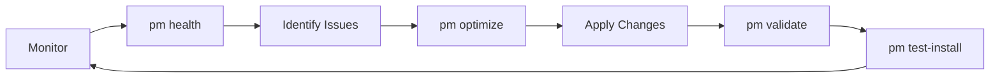

# ClaudeAutoPM Self-Maintenance Guide

## Overview

ClaudeAutoPM uses its own framework capabilities for self-maintenance, creating a self-improving ecosystem. This guide explains how the system maintains itself.

## Architecture

```
AUTOPM/                          # Development project
├── .claude/                     # Project-specific config
│   ├── base.md                 # Project context
│   ├── config.json             # Configuration
│   ├── commands/               # PM maintenance commands
│   │   ├── pm                  # Main command router
│   │   ├── pm-validate         # Validation
│   │   ├── pm-optimize         # Optimization
│   │   ├── pm-test-install     # Installation testing
│   │   ├── pm-health          # Health reporting
│   │   └── pm-release         # Release preparation
│   └── strategies/            # Execution strategies
│       └── self-maintenance-strategy.md
│
└── autopm/.claude/            # Framework resources
    └── agents/                # Framework agents used for maintenance
        ├── core/
        │   ├── agent-manager.md
        │   ├── code-analyzer.md
        │   ├── test-runner.md
        │   └── file-analyzer.md
        ├── devops/
        │   └── github-operations-specialist.md
        └── frameworks/
            └── [various framework agents]
```

## How It Works

### 1. Framework Agents for Maintenance

The project uses its own framework agents from `autopm/.claude/agents/`:

- **agent-manager**: Creates and manages agents
- **code-analyzer**: Reviews code changes
- **test-runner**: Executes and analyzes tests
- **file-analyzer**: Summarizes large files
- **github-operations-specialist**: Manages releases

### 2. PM Commands

Located in `.claude/commands/`, these scripts orchestrate maintenance tasks:

```bash
# Check project health
pm health

# Validate integrity
pm validate

# Analyze optimization opportunities
pm optimize

# Test installation scenarios
pm test-install

# Prepare release
pm release
```

### 3. Self-Maintenance Workflow



## Usage Examples

### Daily Maintenance

```bash
# Morning health check
pm health

# If issues found
pm validate

# Analyze opportunities
pm optimize
```

### Before Commits

```bash
# Validate changes
pm validate

# Quick test
pm test-install
```

### Release Process

```bash
# Full validation
pm validate
pm test-install

# Prepare release
pm release
```

## Agent Integration

### Using Framework Agents

When Claude Code works on the project, it can use framework agents:

```markdown
@agent-manager create a new specialized agent for GraphQL
@code-analyzer review recent changes for bugs
@test-runner execute installation tests
@github-operations-specialist prepare release v1.0.4
```

### Agent Mapping

| Task | Framework Agent | PM Command |
|------|----------------|------------|
| Create agents | agent-manager | - |
| Review code | code-analyzer | pm validate |
| Run tests | test-runner | pm test-install |
| Analyze logs | file-analyzer | pm health |
| Manage releases | github-operations-specialist | pm release |

## Automation

### GitHub Actions

```yaml
# .github/workflows/self-maintenance.yml
name: Self-Maintenance
on:
  schedule:
    - cron: '0 0 * * *'  # Daily
  workflow_dispatch:

jobs:
  health-check:
    runs-on: ubuntu-latest
    steps:
      - uses: actions/checkout@v4
      - name: Health Check
        run: |
          .claude/commands/pm-health
          .claude/commands/pm-validate
```

### Git Hooks

```bash
# .git/hooks/pre-commit
#!/bin/bash
.claude/commands/pm-validate
```

## Metrics

The system tracks:

- **Agent count**: Target <30
- **Test coverage**: Target >90%
- **Context efficiency**: Target >70%
- **Installation success**: Target >98%

## Benefits

1. **Dogfooding**: Project uses its own capabilities
2. **Continuous Improvement**: Self-optimizing system
3. **Quality Assurance**: Automated validation
4. **Efficiency**: Reduced maintenance overhead

## Troubleshooting

### Common Issues

1. **PM commands not found**
   ```bash
   chmod +x .claude/commands/pm*
   ```

2. **Agent not recognized**
   - Ensure CLAUDE.md references framework agents
   - Check agent exists in `autopm/.claude/agents/`

3. **Tests failing**
   ```bash
   pm validate
   npm test
   ```

## Next Steps

1. Run `pm health` to check current status
2. Use `pm optimize` to find improvements
3. Apply framework agents for maintenance tasks
4. Monitor metrics with `pm health`

The self-maintenance system ensures ClaudeAutoPM continuously improves while maintaining stability and quality.