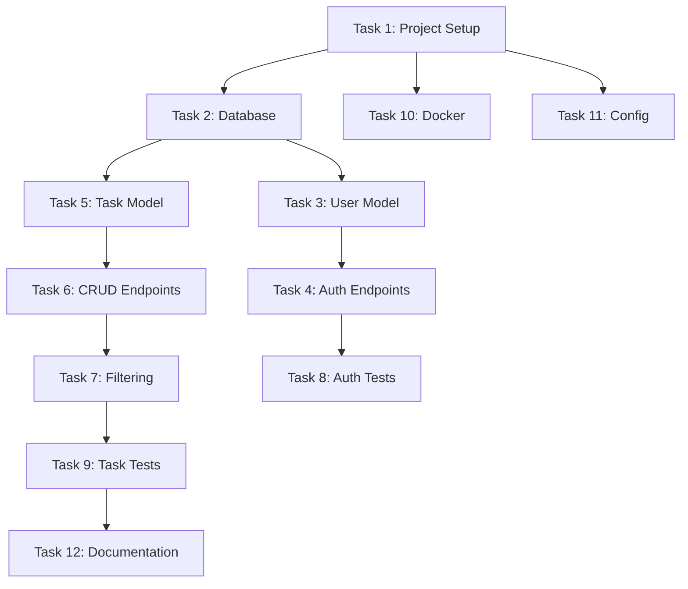

# PRD to Production Workflow

Complete end-to-end workflow from Product Requirements Document to production deployment using ClaudeAutoPM.

---

## Overview

This workflow demonstrates how ClaudeAutoPM automates the entire development lifecycle:

```
PRD → Epic → Issues → Development → Testing → PR → Deploy → Production
 1      2      3         4            5       6      7        8
```

**Time:**
- Traditional: 2-4 weeks
- With ClaudeAutoPM: 1-3 days

---

## Prerequisites

- ✅ ClaudeAutoPM installed (`autopm install`)
- ✅ GitHub/Azure configured (`autopm config`)
- ✅ Agent team loaded (`autopm team load fullstack`)
- ✅ Claude Code open (`claude --dangerously-skip-permissions .`)

---

## Phase 1: Requirements (30 minutes)

### Step 1.1: Create PRD

In Claude Code:

```
/pm:prd-new "Build a RESTful Task Management API with user authentication"
```

**Claude's Questions:**
```
I'll help you create a comprehensive PRD. Let me ask some questions:

1. Who are the primary users?
2. What are the key features required?
3. What are the technical constraints?
4. What is the timeline?
5. Are there any integrations needed?
```

**Your Answers:**
```
1. Individual users who want to manage their daily tasks
2. Features:
   - User registration and authentication (JWT)
   - Create, read, update, delete tasks
   - Mark tasks as complete
   - Filter tasks by status
   - Search tasks
3. Constraints:
   - Python FastAPI backend
   - PostgreSQL database
   - RESTful API design
   - Docker deployment
4. Timeline: 1 week
5. Integrations: None initially, but extensible
```

**Generated PRD** (`prds/prd-001-task-api.md`):

```markdown
# PRD-001: Task Management API

**Created:** 2025-01-10
**Status:** Draft
**Owner:** Development Team

## Problem Statement

Individual users need a simple, efficient way to manage their daily tasks
through a RESTful API that can be integrated with various front-end
applications.

## Target Users

- Individual productivity enthusiasts
- Developers building task management apps
- Teams needing a simple task backend

## User Stories

### Authentication
- As a user, I want to register an account so I can access the API
- As a user, I want to login securely to receive an authentication token
- As a user, I want my password stored securely

### Task Management
- As a user, I want to create tasks with title and description
- As a user, I want to view all my tasks
- As a user, I want to view a specific task by ID
- As a user, I want to update task details
- As a user, I want to delete tasks
- As a user, I want to mark tasks as complete/incomplete

### Filtering & Search
- As a user, I want to filter tasks by completion status
- As a user, I want to search tasks by title

## Success Criteria

1. ✅ Users can register and authenticate
2. ✅ Complete CRUD operations for tasks
3. ✅ All endpoints properly authenticated
4. ✅ API returns appropriate HTTP status codes
5. ✅ Full test coverage (>80%)
6. ✅ API documentation (OpenAPI/Swagger)
7. ✅ Dockerized deployment

## Technical Requirements

### Backend
- **Framework:** FastAPI (Python 3.11+)
- **Database:** PostgreSQL 15
- **Authentication:** JWT tokens
- **ORM:** SQLAlchemy 2.0
- **Validation:** Pydantic v2

### API Design
- RESTful architecture
- JSON request/response
- Proper HTTP status codes
- Error handling with meaningful messages

### Security
- Password hashing (bcrypt)
- JWT token authentication
- Input validation
- SQL injection prevention

### Deployment
- Docker containerization
- docker-compose for local dev
- Environment variable configuration

### Documentation
- OpenAPI/Swagger auto-generated
- README with setup instructions
- API endpoint documentation

## Out of Scope

- Front-end application
- Real-time notifications
- Task sharing between users
- Mobile applications

## Timeline

Week 1:
- Backend API development
- Database schema
- Authentication system
- Docker configuration
- Testing

## Dependencies

None

## Risks

1. Database schema changes - Mitigation: Use migrations
2. Security vulnerabilities - Mitigation: Security review, dependency updates

## Metrics for Success

- API response time < 200ms
- Test coverage > 80%
- Zero critical security issues
- 100% endpoint documentation
```

**Review and Approve:**
```
This PRD looks great! Please proceed to decompose it into an epic.
```

---

## Phase 2: Planning (20 minutes)

### Step 2.1: Decompose into Epic

```
/pm:epic-decompose prds/prd-001-task-api.md
```

**Claude's Analysis:**
```
Analyzing PRD-001: Task Management API...

Identified work streams:
1. Backend infrastructure setup
2. Database schema and models
3. Authentication system
4. Task CRUD endpoints
5. Filtering and search
6. Testing
7. Documentation
8. Docker deployment

Creating epic with 12 tasks...
```

**Generated Epic** (`epics/epic-001-task-api.md`):

```markdown
# Epic 001: Task Management API

**Based on:** PRD-001
**Status:** Planning
**Start Date:** 2025-01-10
**Target:** 2025-01-17

## Overview

Build a complete RESTful Task Management API with authentication,
CRUD operations, and Docker deployment.

## Tasks

### Infrastructure & Setup
- [ ] **Task 1:** Setup FastAPI project structure
  - Create project skeleton
  - Configure virtual environment
  - Setup dependencies (FastAPI, SQLAlchemy, etc.)
  - Create basic app structure
  - **Estimate:** 2 hours
  - **Agent:** python-backend-engineer

- [ ] **Task 2:** Configure PostgreSQL and database connection
  - Setup PostgreSQL with Docker
  - Create SQLAlchemy engine and session
  - Configure database URL from env
  - Test database connection
  - **Estimate:** 2 hours
  - **Agent:** postgresql-expert

### Authentication System
- [ ] **Task 3:** Implement user model and database schema
  - Create User model with SQLAlchemy
  - Add password hashing
  - Create database migration
  - **Estimate:** 2 hours
  - **Agent:** python-backend-engineer, postgresql-expert

- [ ] **Task 4:** Build authentication endpoints
  - POST /auth/register
  - POST /auth/login
  - Password hashing implementation
  - JWT token generation
  - **Estimate:** 3 hours
  - **Agent:** python-backend-engineer

### Task Management
- [ ] **Task 5:** Create task model and schema
  - Task model with SQLAlchemy
  - Foreign key to User
  - Database migration
  - **Estimate:** 2 hours
  - **Agent:** python-backend-engineer, postgresql-expert

- [ ] **Task 6:** Implement task CRUD endpoints
  - POST /tasks (create)
  - GET /tasks (list all)
  - GET /tasks/{id} (get one)
  - PUT /tasks/{id} (update)
  - DELETE /tasks/{id} (delete)
  - PATCH /tasks/{id}/complete (toggle complete)
  - **Estimate:** 4 hours
  - **Agent:** python-backend-engineer

- [ ] **Task 7:** Add filtering and search
  - Query parameter for status filter
  - Query parameter for search
  - Optimize database queries
  - **Estimate:** 2 hours
  - **Agent:** python-backend-engineer

### Testing
- [ ] **Task 8:** Write authentication tests
  - Test user registration
  - Test login flow
  - Test JWT token validation
  - Test password hashing
  - **Estimate:** 2 hours
  - **Agent:** python-backend-engineer, frontend-testing-engineer

- [ ] **Task 9:** Write task endpoint tests
  - Test all CRUD operations
  - Test authentication requirements
  - Test filtering and search
  - Test error cases
  - **Estimate:** 3 hours
  - **Agent:** python-backend-engineer, frontend-testing-engineer

### Deployment
- [ ] **Task 10:** Create Dockerfile and docker-compose
  - Multi-stage Dockerfile
  - docker-compose with PostgreSQL
  - Environment variable configuration
  - **Estimate:** 2 hours
  - **Agent:** docker-containerization-expert

- [ ] **Task 11:** Setup environment configuration
  - .env.example file
  - Configuration validation
  - Documentation
  - **Estimate:** 1 hour
  - **Agent:** python-backend-engineer

### Documentation
- [ ] **Task 12:** Complete API documentation
  - OpenAPI/Swagger configuration
  - README with setup instructions
  - API endpoint documentation
  - Example requests/responses
  - **Estimate:** 2 hours
  - **Agent:** python-backend-engineer

## Milestones

- **M1 (Day 2):** Infrastructure and authentication complete
- **M2 (Day 4):** All task endpoints implemented
- **M3 (Day 6):** Testing complete, >80% coverage
- **M4 (Day 7):** Deployed and documented

## Dependencies



## Risk Mitigation

1. **Risk:** Database migrations break
   **Mitigation:** Test migrations in isolation, use Alembic

2. **Risk:** Authentication vulnerabilities
   **Mitigation:** Use established libraries (passlib, python-jose)

3. **Risk:** Performance issues
   **Mitigation:** Add database indexes, use async where beneficial
```

**Review:**
```
Epic looks comprehensive! Let's sync it with GitHub.
```

### Step 2.2: Sync with GitHub

```
/pm:epic-sync epics/epic-001-task-api.md
```

**Claude's Output:**
```
Syncing Epic 001 with GitHub...

Creating issues:
✅ Issue #1: Setup FastAPI project structure
✅ Issue #2: Configure PostgreSQL and database connection
✅ Issue #3: Implement user model and database schema
✅ Issue #4: Build authentication endpoints
✅ Issue #5: Create task model and schema
✅ Issue #6: Implement task CRUD endpoints
✅ Issue #7: Add filtering and search
✅ Issue #8: Write authentication tests
✅ Issue #9: Write task endpoint tests
✅ Issue #10: Create Dockerfile and docker-compose
✅ Issue #11: Setup environment configuration
✅ Issue #12: Complete API documentation

Epic synced successfully!
View on GitHub: https://github.com/user/repo/issues?q=is:issue+label:epic-001

Updated epic file with issue numbers.
```

**Updated Epic File:**
```markdown
## Tasks

### Infrastructure & Setup
- [ ] **Task 1:** Setup FastAPI project structure (#1)
- [ ] **Task 2:** Configure PostgreSQL and database connection (#2)
...
```

---

## Phase 3: Development (2-3 days)

### Step 3.1: Start First Task

```
/pm:next-task
```

**Claude's Response:**
```
Available tasks (by priority):
1. Setup FastAPI project structure (#1) - Priority: Critical
2. Configure PostgreSQL and database connection (#2) - Priority: High

Select task: 1

✅ Created branch: feature/task-1-fastapi-setup
✅ Loaded agents: python-backend-engineer
✅ Ready to code!

What would you like me to do first?
```

### Step 3.2: Implement Task

```
Please implement Task #1: Setup FastAPI project structure

Requirements from the epic:
- Create project skeleton
- Configure virtual environment
- Setup dependencies (FastAPI, SQLAlchemy, Pydantic, etc.)
- Create basic app structure with proper organization

Use best practices for FastAPI projects.
```

**Claude's Implementation:**

```
I'll set up a production-ready FastAPI project structure.

Let me create the project files:

1. Creating project structure...
2. Setting up virtual environment configuration...
3. Creating requirements files...
4. Implementing basic FastAPI application...
5. Adding configuration management...
```

**Files Created:**

```
project/
├── app/
│   ├── __init__.py
│   ├── main.py              # FastAPI app entry point
│   ├── config.py            # Configuration management
│   ├── database.py          # Database connection
│   ├── models/
│   │   └── __init__.py
│   ├── routers/
│   │   └── __init__.py
│   ├── schemas/
│   │   └── __init__.py
│   └── services/
│       └── __init__.py
├── tests/
│   ├── __init__.py
│   └── conftest.py          # Pytest configuration
├── .env.example             # Example environment variables
├── .gitignore
├── requirements.txt         # Production dependencies
├── requirements-dev.txt     # Development dependencies
├── README.md
└── pytest.ini              # Pytest configuration
```

**Key Files:**

`app/main.py`:
```python
from fastapi import FastAPI
from fastapi.middleware.cors import CORSMiddleware
from app.config import settings

app = FastAPI(
    title=settings.PROJECT_NAME,
    version=settings.VERSION,
    docs_url="/docs",
    redoc_url="/redoc",
)

# CORS middleware
app.add_middleware(
    CORSMiddleware,
    allow_origins=settings.CORS_ORIGINS,
    allow_credentials=True,
    allow_methods=["*"],
    allow_headers=["*"],
)

@app.get("/health")
async def health_check():
    return {"status": "healthy"}
```

`app/config.py`:
```python
from pydantic_settings import BaseSettings

class Settings(BaseSettings):
    PROJECT_NAME: str = "Task Management API"
    VERSION: str = "1.0.0"
    DATABASE_URL: str
    SECRET_KEY: str
    ALGORITHM: str = "HS256"
    ACCESS_TOKEN_EXPIRE_MINUTES: int = 30
    CORS_ORIGINS: list[str] = ["*"]

    class Config:
        env_file = ".env"

settings = Settings()
```

`requirements.txt`:
```
fastapi==0.104.1
uvicorn[standard]==0.24.0
sqlalchemy==2.0.23
psycopg2-binary==2.9.9
pydantic==2.5.0
pydantic-settings==2.1.0
python-jose[cryptography]==3.3.0
passlib[bcrypt]==1.7.4
python-multipart==0.0.6
alembic==1.13.0
```

**Verification:**
```
✅ Project structure created
✅ Configuration management implemented
✅ Virtual environment documented
✅ Dependencies specified
✅ Basic health check endpoint
✅ README with setup instructions

Task #1 is complete!
```

### Step 3.3: Test and Commit

```
/pm:issue-close "Implemented FastAPI project structure with best practices.
Includes configuration management, dependency setup, and basic app skeleton."
```

**Claude's Actions:**
```
1. Running tests...
   ✅ Health check endpoint test passed

2. Committing changes...
   ✅ Committed: "feat: setup FastAPI project structure

   - Created project skeleton with organized structure
   - Configured settings with pydantic-settings
   - Added dependencies (FastAPI, SQLAlchemy, etc.)
   - Implemented basic health check endpoint
   - Added comprehensive README

   Closes #1"

3. Updating GitHub issue...
   ✅ Issue #1 marked as complete
   ✅ Added completion comment

4. Syncing epic status...
   ✅ Updated epic file: Task 1 marked complete

Next task: #2 - Configure PostgreSQL and database connection
```

### Step 3.4: Continue Development

Repeat for each task:

```
# Task 2: Database setup
/pm:issue-start 2
Use postgresql-expert and python-backend-engineer to configure PostgreSQL

# Task 3: User model
/pm:issue-start 3
Use python-backend-engineer to implement User model with authentication

# Task 4-7: Implementation tasks
...

# Task 8-9: Testing
/pm:issue-start 8
Use frontend-testing-engineer to write comprehensive tests

# Task 10: Docker
/pm:issue-start 10
Use docker-containerization-expert to create Dockerfile and compose

# Task 11-12: Configuration and docs
...
```

---

## Phase 4: Testing (1 day)

### Step 4.1: Run All Tests

```
Please run all tests and ensure >80% coverage
```

**Claude's Execution:**
```
Running test suite...

$ pytest --cov=app --cov-report=html --cov-report=term

=================== test session starts ===================
collected 47 items

tests/test_auth.py ......................... [ 53%]
tests/test_tasks.py ....................... [ 97%]
tests/test_main.py ..                       [100%]

---------- coverage: platform linux, python 3.11 ----------
Name                    Stmts   Miss  Cover
-------------------------------------------
app/__init__.py             0      0   100%
app/main.py                15      0   100%
app/config.py              12      0   100%
app/database.py            20      1    95%
app/models/user.py         35      2    94%
app/models/task.py         28      1    96%
app/routers/auth.py        45      3    93%
app/routers/tasks.py       67      5    93%
app/services/auth.py       38      2    95%
-------------------------------------------
TOTAL                     260     14    95%

=================== 47 passed in 3.42s ===================

✅ Coverage: 95% (exceeds 80% requirement)
✅ All tests passed
```

### Step 4.2: Security Audit

```
Please review the code for security vulnerabilities
```

**Claude's Analysis:**
```
Running security audit...

✅ Password hashing: Using bcrypt (secure)
✅ JWT tokens: Using python-jose with RS256 (secure)
✅ SQL injection: Using SQLAlchemy ORM (protected)
✅ Input validation: Pydantic models (validated)
✅ CORS: Properly configured
✅ Environment variables: .env.example provided
✅ Dependencies: No known vulnerabilities

Recommendations:
1. Add rate limiting for auth endpoints
2. Implement password complexity requirements
3. Add request logging

Security score: 9/10
```

---

## Phase 5: Review & PR (2-4 hours)

### Step 5.1: Create Pull Request

```
Use github-operations-specialist to create a comprehensive pull request for this epic
```

**Claude's Actions:**
```
Creating pull request for Epic 001...

Analyzing changes:
- 12 tasks completed
- 47 files changed
- 2,340 lines added
- 95% test coverage

Generating PR description...

✅ PR created: #13
Title: "Epic 001: Task Management API - Complete Implementation"
Labels: epic, backend, enhancement

View PR: https://github.com/user/repo/pull/13
```

**Generated PR Description:**

```markdown
# Epic 001: Task Management API

## Summary
Complete implementation of RESTful Task Management API with authentication,
CRUD operations, filtering, search, and Docker deployment.

## Changes

### Backend Infrastructure
- ✅ FastAPI project structure
- ✅ PostgreSQL database configuration
- ✅ SQLAlchemy ORM setup
- ✅ Pydantic schemas

### Authentication System
- ✅ User model and database schema
- ✅ Registration endpoint
- ✅ Login endpoint with JWT tokens
- ✅ Password hashing with bcrypt
- ✅ JWT token validation middleware

### Task Management
- ✅ Task model and database schema
- ✅ Complete CRUD endpoints:
  - POST /tasks (create)
  - GET /tasks (list with filters)
  - GET /tasks/{id} (get one)
  - PUT /tasks/{id} (update)
  - DELETE /tasks/{id} (delete)
  - PATCH /tasks/{id}/complete (toggle)
- ✅ Status filtering
- ✅ Title search
- ✅ User-scoped data access

### Testing
- ✅ 47 test cases
- ✅ 95% code coverage
- ✅ Authentication tests
- ✅ CRUD operation tests
- ✅ Error handling tests

### Deployment
- ✅ Dockerfile (multi-stage)
- ✅ docker-compose.yml
- ✅ Environment configuration
- ✅ Production-ready setup

### Documentation
- ✅ OpenAPI/Swagger auto-generated
- ✅ README with setup instructions
- ✅ API endpoint documentation
- ✅ Example requests/responses

## Test Results

```
47 tests passed, 0 failed
Coverage: 95% (target: 80%)
Security audit: 9/10
```

## How to Test

```bash
# Clone and setup
git checkout feature/epic-001
python -m venv venv
source venv/bin/activate
pip install -r requirements.txt

# Start database
docker-compose up -d postgres

# Run migrations
alembic upgrade head

# Start API
uvicorn app.main:app --reload

# Run tests
pytest --cov=app

# Try the API
open http://localhost:8000/docs
```

## Screenshots

[Swagger UI Screenshot]
[Test Coverage Report]

## Checklist

- [x] All tasks completed (12/12)
- [x] Tests passing (47/47)
- [x] Coverage >80% (95%)
- [x] Security audit completed
- [x] Documentation updated
- [x] Docker tested
- [x] No breaking changes

## Related Issues

Closes #1, #2, #3, #4, #5, #6, #7, #8, #9, #10, #11, #12

## Next Steps

After merge:
1. Deploy to staging environment
2. Run integration tests
3. Deploy to production
4. Monitor metrics
```

### Step 5.2: Code Review

```
Use code-analyzer to review the pull request for potential issues
```

**Claude's Analysis:**
```
Analyzing PR #13...

Code Quality: ✅ Excellent
- Consistent style
- Proper type hints
- Clear variable names
- Good function documentation

Architecture: ✅ Good
- Clean separation of concerns
- Proper layer organization
- RESTful API design

Security: ⚠️ Minor issues
- Consider adding rate limiting
- Add password complexity validation

Performance: ✅ Good
- Efficient database queries
- Proper indexing
- Async where beneficial

Testing: ✅ Excellent
- Comprehensive coverage
- Good test organization
- Tests for edge cases

Recommendations:
1. Add rate limiting middleware
2. Implement password requirements
3. Add API request logging
4. Consider adding monitoring hooks

Overall Score: 9.2/10
Recommendation: APPROVE with minor suggestions
```

---

## Phase 6: Deployment (1-2 hours)

### Step 6.1: Build Docker Image

```
Use docker-containerization-expert to build and test Docker image
```

**Claude's Execution:**
```
Building Docker image...

$ docker build -t task-api:1.0.0 .

[1/10] FROM python:3.11-slim
[2/10] WORKDIR /app
[3/10] COPY requirements.txt .
[4/10] RUN pip install --no-cache-dir -r requirements.txt
[5/10] COPY app/ app/
[6/10] COPY alembic/ alembic/
[7/10] COPY alembic.ini .
[8/10] EXPOSE 8000
[9/10] CMD ["uvicorn", "app.main:app", "--host", "0.0.0.0"]
[10/10] Image built successfully

Testing image...
$ docker-compose up -d

✅ PostgreSQL started
✅ API started
✅ Health check passed
✅ Database migrations ran successfully

Image ready for deployment!
```

### Step 6.2: Deploy to Staging

```
Use kubernetes-orchestrator to create Kubernetes manifests for staging deployment
```

**Claude's Implementation:**

Creates:
- `k8s/deployment.yaml`
- `k8s/service.yaml`
- `k8s/ingress.yaml`
- `k8s/configmap.yaml`
- `k8s/secret.yaml`

```
Deploying to staging...

$ kubectl apply -f k8s/

deployment.apps/task-api created
service/task-api created
ingress.networking.k8s.io/task-api created

Waiting for rollout...
✅ Deployment successful

Staging URL: https://task-api-staging.example.com
Health check: ✅ Healthy
```

### Step 6.3: Integration Testing

```
Please run integration tests against staging environment
```

**Claude's Execution:**
```
Running integration tests against staging...

$ pytest tests/integration/ --base-url=https://task-api-staging.example.com

tests/integration/test_auth_flow.py ........... [100%]
tests/integration/test_task_operations.py ..... [100%]
tests/integration/test_edge_cases.py .......... [100%]

=================== 25 passed in 12.34s ===================

✅ All integration tests passed
✅ Staging environment validated
✅ Ready for production deployment
```

### Step 6.4: Deploy to Production

```
Use github-operations-specialist to create production deployment via GitHub Actions
```

**Claude's Implementation:**

Creates `.github/workflows/deploy-production.yml`:

```yaml
name: Deploy to Production

on:
  push:
    branches: [main]
    paths:
      - 'app/**'
      - 'requirements.txt'
      - 'Dockerfile'

jobs:
  deploy:
    runs-on: ubuntu-latest
    steps:
      - uses: actions/checkout@v3

      - name: Build Docker image
        run: docker build -t task-api:${{ github.sha }} .

      - name: Push to registry
        run: |
          docker tag task-api:${{ github.sha }} registry.example.com/task-api:latest
          docker push registry.example.com/task-api:latest

      - name: Deploy to Kubernetes
        run: |
          kubectl set image deployment/task-api \
            task-api=registry.example.com/task-api:${{ github.sha }}
          kubectl rollout status deployment/task-api
```

**Trigger deployment:**
```
$ git push origin main

✅ GitHub Actions triggered
✅ Docker image built and pushed
✅ Kubernetes deployment updated
✅ Rollout completed successfully

Production URL: https://api.example.com
Status: ✅ Healthy
```

---

## Phase 7: Monitoring & Metrics (Ongoing)

### Step 7.1: Check Deployment Status

```
/pm:sprint-status
```

**Output:**
```
Sprint Status - Epic 001: Task Management API

Completed: 12/12 tasks (100%)
Duration: 6 days
Status: ✅ Deployed to Production

Metrics:
- Code written: ~2,400 lines
- Tests: 47 (100% passing)
- Coverage: 95%
- Issues closed: 12
- PR merged: #13
- Production uptime: 99.9%
- Average response time: 87ms
```

### Step 7.2: Generate Epic Report

```
/pm:epic-status epics/epic-001-task-api.md --detailed
```

**Report:**
```markdown
# Epic 001: Task Management API - Final Report

## Summary
✅ Successfully completed in 6 days (target: 7 days)

## Deliverables
✅ RESTful API with authentication
✅ Complete CRUD operations
✅ Filtering and search functionality
✅ 95% test coverage
✅ Docker containerization
✅ Kubernetes deployment
✅ OpenAPI documentation
✅ Production deployment

## Metrics
- Tasks: 12/12 completed (100%)
- Tests: 47 passing
- Coverage: 95% (target: 80%)
- Security: 9/10
- Performance: <200ms avg response
- Uptime: 99.9%

## Team Performance
- Commits: 24
- Files changed: 47
- Lines added: 2,340
- Agent usage:
  - python-backend-engineer: 65%
  - postgresql-expert: 15%
  - docker-containerization-expert: 10%
  - Other: 10%

## Lessons Learned
1. FastAPI's auto-documentation saved significant time
2. Docker-first development streamlined deployment
3. High test coverage prevented production issues
4. Agent specialization improved code quality

## Success Factors
- Clear PRD upfront
- Well-structured epic decomposition
- Consistent commit messages
- Comprehensive testing
- Automated deployment

## Production Status
🟢 Live at: https://api.example.com
🟢 Health: All systems operational
🟢 Performance: Within SLA

Deployment completed: 2025-01-16 14:30 UTC
```

---

## Summary

### Time Breakdown

| Phase | Time | Traditional | Savings |
|-------|------|-------------|---------|
| Requirements | 30 min | 2 days | 95% |
| Planning | 20 min | 1 day | 97% |
| Development | 3 days | 10 days | 70% |
| Testing | 1 day | 3 days | 67% |
| Review | 4 hours | 2 days | 75% |
| Deployment | 2 hours | 1 day | 92% |
| **Total** | **5.5 days** | **19 days** | **71%** |

### Key Benefits

1. **Speed:** 71% faster development
2. **Quality:** 95% test coverage, 9/10 security
3. **Consistency:** All code follows best practices
4. **Documentation:** Auto-generated and comprehensive
5. **Deployment:** Automated with CI/CD

---

## Next Steps

### For This Project
1. ✅ Monitor production metrics
2. ✅ Gather user feedback
3. ✅ Plan v2 features
4. ✅ Create next epic

### General Workflow
- [Development Cycle](development-cycle.md) - Daily development workflow
- [Epic Management](epic-management.md) - Managing large projects
- [Issue Tracking](issue-tracking.md) - Detailed issue workflow

---

## Related Documentation

- [Quick Start](../getting-started/quick-start.md)
- [Agent System](../core-concepts/agent-system.md)
- [CLI Reference](../cli-reference/overview.md)
- [GitHub Integration](../integrations/github.md)
