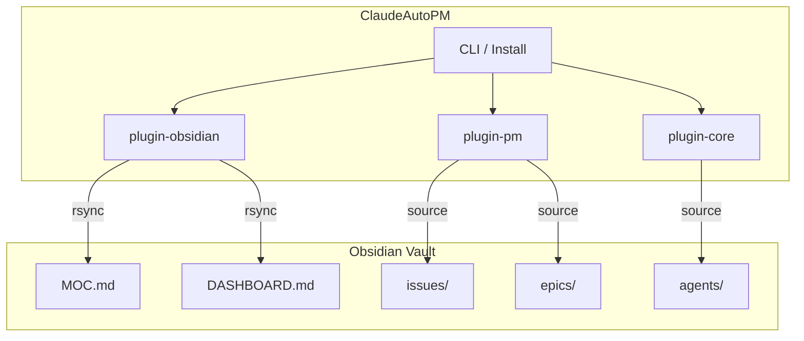

# Architecture Overview

```mermaid
graph TB
    subgraph "ClaudeAutoPM"
        CLI[CLI / Install]
        Core[plugin-core]
        PM[plugin-pm]
        Obsidian[plugin-obsidian]
    end

    subgraph "Obsidian Vault"
        MOC[MOC.md]
        Dashboard[DASHBOARD.md]
        Issues[issues/]
        Epics[epics/]
        Agents[agents/]
    end

    CLI --> Core
    CLI --> PM
    CLI --> Obsidian
    Obsidian -->|rsync| MOC
    Obsidian -->|rsync| Dashboard
    PM -->|source| Issues
    PM -->|source| Epics
    Core -->|source| Agents
```

## Notes

Edit this diagram to match your project's architecture. Uses [Mermaid](https://mermaid.js.org/) syntax.
